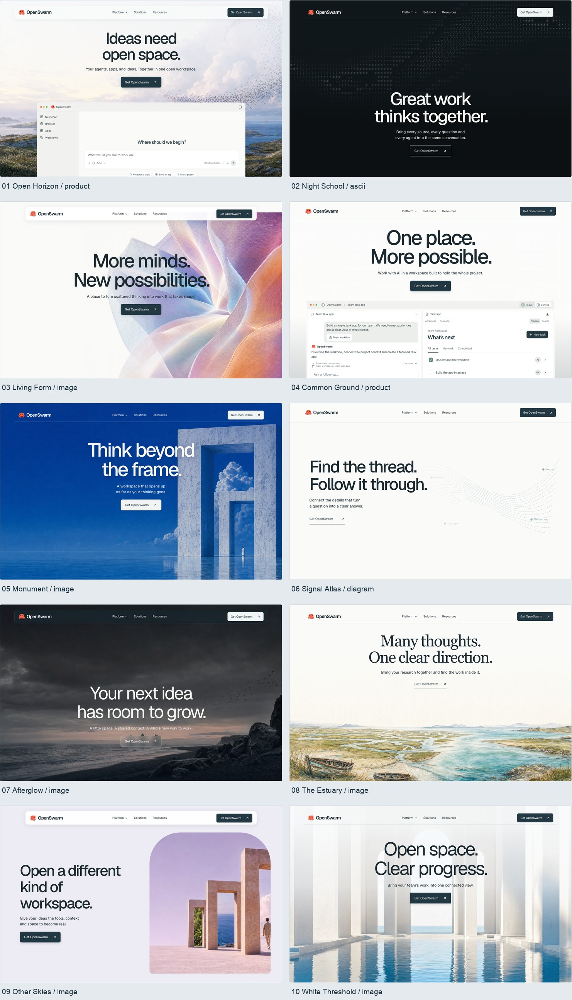
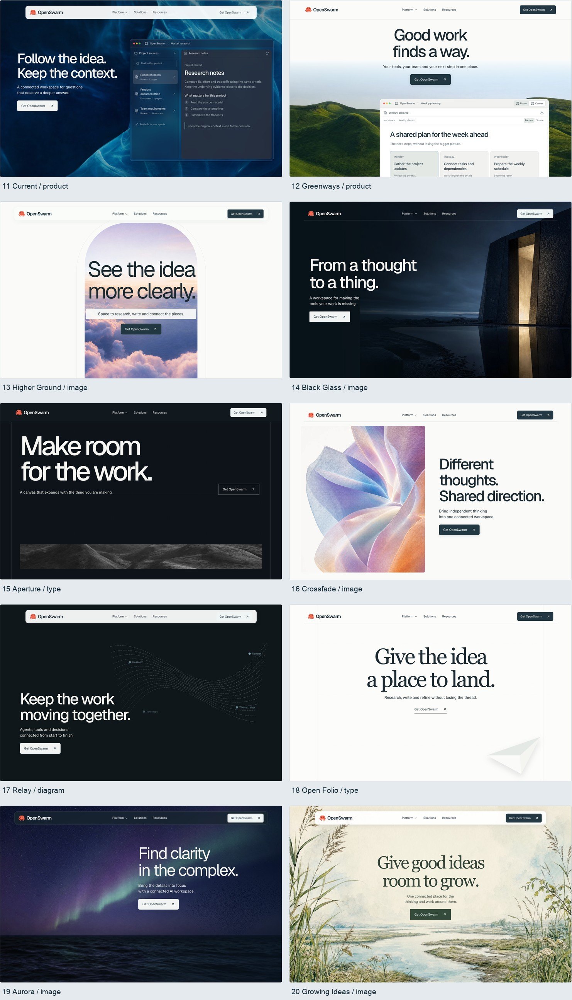
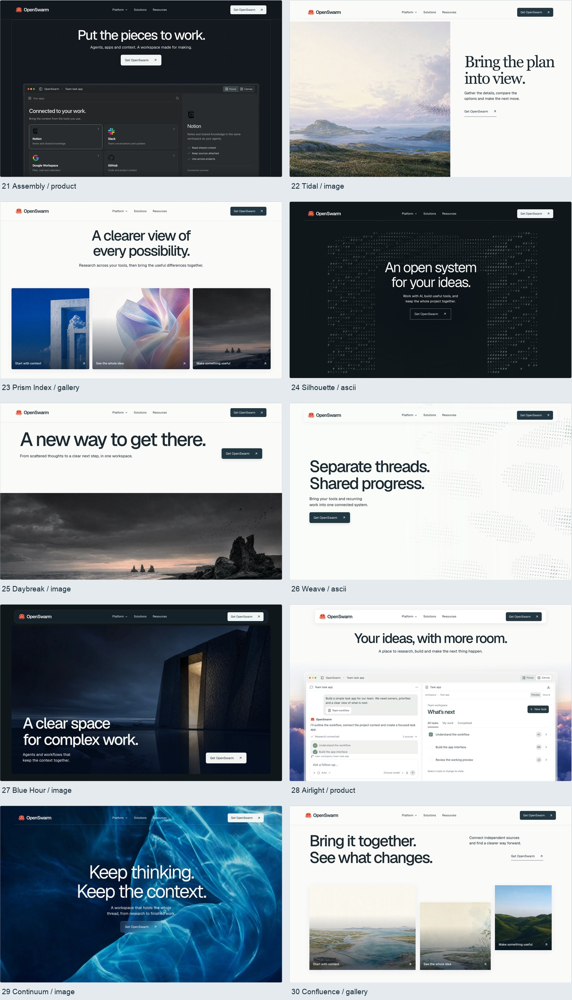

# OpenSwarm direction review

**30 visual directions · 186 scenes · 24 heroes without a product window.**

The interactive review includes six or seven scenes per direction, light/dark/ASCII filters, motion studies, mega navigation, sample native product interactions and a persistent shortlist.

## Browse the directions on GitHub

[All scene notes and complete boards](docs/review/STORYBOARDS.md) · [Reference foundation](docs/review/REFERENCE-LOCK.md)

| Directions 01–10 | Directions 11–20 | Directions 21–30 |
| --- | --- | --- |
| [](docs/review/media/openings-1.jpg) | [](docs/review/media/openings-11.jpg) | [](docs/review/media/openings-21.jpg) |

For an offline gallery, clone/download the repository and open `docs/review/index.html`.

## Run the interactive review

Requires Node.js 22.13+.

```sh
npm ci
npm run dev
```

Open **http://localhost:5173/**. Query links select a direction and scene, for example `/?direction=afterglow&frame=1`.

```sh
npm run build
npm run preview
```

The built static application is in `dist/`. No API keys, server, database or environment file are needed. For a subdirectory deployment, build with its base path, for example `BASE_PATH=/OpenswarmWeb2/ npm run build`.

## Validate

```sh
npm run typecheck
npm run lint
npx playwright install chromium
npm run test
```

Run the dev server before browser tests. Set `REVIEW_URL` to test a different served build.

## Scope

These are interactive website storyboards and motion studies, not thirty finished production sites. Product actions use local sample state. Evidence Lab scenes contain the supplied original app captures with their disclosures intact. Motion uses existing scenic films, a supplied product recording, live glyph fields and CSS/SVG transitions. Scene notes also document intended continuity for a finished scroll experience.

This package publishes the direction review independently of the production marketing site. Its source and final review media are included; local credentials, environment files, session history and unrelated work are excluded.

## Source and licenses

The native Plan component retains its supplied MIT license in `src/components/product/toolui/plan/LICENSE.md`. Geist and Geist Mono are distributed under the SIL Open Font License in `src/fonts/OFL.txt`. OpenSwarm brand, artwork and supplied app captures retain their respective ownership; this repository does not grant them a new open-source license.
