# OpenSwarm — 30 direction storyboards

186 scenes, with six or seven scenes in every direction. 24 openings lead with image, typography, ASCII, a diagram or an image index; 6 lead with a product surface.

[Open the interactive review](http://localhost:5173/) · [Open the static review](index.html)

These are interactive website storyboards. Each scene describes a page moment, its motion intent and an action to review. They are not thirty production sites.

The working examples use local sample state. The Evidence Lab chapters show the supplied original app captures with their disclosures intact. Motion includes three existing scenic films, a supplied product recording, live character fields and CSS/SVG transitions; scene notes also describe the intended continuity for a finished scroll experience.

## Direction index

- [01 Open Horizon](#01-horizon) — Centered coast · frosted navigation; 6 scenes; product opening
- [02 Night School](#02-night) — Dark ASCII · dense living field; 6 scenes; no product in opening
- [03 Living Form](#03-living) — Spectral paper · native light surfaces; 6 scenes; no product in opening
- [04 Common Ground](#04-common) — Monochrome · product-led typography; 7 scenes; product opening
- [05 Monument](#05-monument) — Cobalt architecture · aperture reveal; 7 scenes; no product in opening
- [06 Signal Atlas](#06-signal) — Light linework · connected evidence; 7 scenes; no product in opening
- [07 Afterglow](#07-afterglow) — Dark coastal film · luminous product; 6 scenes; no product in opening
- [08 The Estuary](#08-estuary) — Watercolor · source-to-result story; 6 scenes; no product in opening
- [09 Other Skies](#09-skies) — Lilac architecture · layered portals; 6 scenes; no product in opening
- [10 White Threshold](#10-threshold) — Chalk architecture · generous light; 6 scenes; no product in opening
- [11 Current](#11-current) — Cyan optics · edge-to-edge product; 6 scenes; product opening
- [12 Greenways](#12-greenways) — Living green · wide photographic canvas; 6 scenes; product opening
- [13 Higher Ground](#13-higher) — Cloud panorama · soft optical depth; 6 scenes; no product in opening
- [14 Black Glass](#14-blackglass) — Obsidian architecture · sharp light; 6 scenes; no product in opening
- [15 Aperture](#15-aperture) — Black and white · expanding frame; 6 scenes; no product in opening
- [16 Crossfade](#16-crossfade) — Spectral diptych · joined workspaces; 6 scenes; no product in opening
- [17 Relay](#17-relay) — Dark linework · visible handoffs; 7 scenes; no product in opening
- [18 Open Folio](#18-folio) — Paper white · document-led composition; 6 scenes; no product in opening
- [19 Aurora](#19-aurora) — Dark natural light · focused depth; 6 scenes; no product in opening
- [20 Growing Ideas](#20-botanical) — Botanical ink · connected branches; 6 scenes; no product in opening
- [21 Assembly](#21-assembly) — Dark modular · product architecture; 6 scenes; product opening
- [22 Tidal](#22-tidal) — Light coast · horizontal chapter rail; 6 scenes; no product in opening
- [23 Prism Index](#23-prism) — Cobalt and paper · editorial image grid; 7 scenes; no product in opening
- [24 Silhouette](#24-silhouette) — Black ASCII · architectural density; 6 scenes; no product in opening
- [25 Daybreak](#25-daybreak) — White-to-dark coast · chapter contrast; 6 scenes; no product in opening
- [26 Weave](#26-weave) — Light ASCII · structured collective motion; 6 scenes; no product in opening
- [27 Blue Hour](#27-blueprint) — Architectural dusk · full-screen app stage; 6 scenes; no product in opening
- [28 Airlight](#28-airlight) — Cloud and paper · expansive native product; 6 scenes; product opening
- [29 Continuum](#29-continuum) — Immersive cyan · persistent workspace; 7 scenes; no product in opening
- [30 Confluence](#30-confluence) — Painted landscape · rich product spread; 6 scenes; no product in opening

## 01 / Open Horizon

A centered opening, a straight native workspace, and a coast that stays continuous as the work expands.

[Open this direction](http://localhost:5173/?direction=horizon) · [Full storyboard image](media/board-01-horizon.jpg)

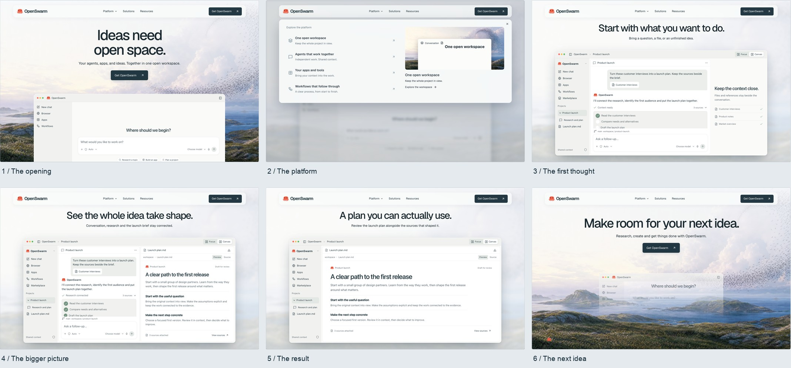

**Composition:** A centered coastal opening with a single native composer rising from the lower edge.

**Reference foundation:** Tasklify / Nexora. Cohere’s substantial product scale. Native OpenSwarm split views and composer.

**Motion direction:** The centered composer opens downward into a full workspace. A soft foreground veil clears as context appears.

**Palette:** #f7f9fa · #152b36 · #b6cbd6

### 1. The opening

**Ideas need open space.**

A centered coastal opening with a single native composer rising from the lower edge.

Motion: The coast moves continuously while the anchored composer opens into the next chapter.

Review action: Explore the native product surface. [Open scene](http://localhost:5173/?direction=horizon&frame=1)

### 2. The platform

**Everything has a place.**

A spacious menu makes agents, apps, workflows and the canvas easy to understand.

Motion: The frosted navigation expands from its own edge; the scene behind it gently defocuses.

Review action: Open Platform and explore a capability. [Open scene](http://localhost:5173/?direction=horizon&frame=2)

### 3. The first thought

**Start with what you want to do.**

Bring a question, a file, or an unfinished idea.

Motion: The composer stays anchored while the conversation grows beneath it.

Review action: Run the sample launch request. [Open scene](http://localhost:5173/?direction=horizon&frame=3)

### 4. The bigger picture

**See the whole idea take shape.**

Conversation, research and the launch brief stay connected.

Motion: One large flat workspace opens into two clear panes. No tilting or tiny floating documents.

Review action: Switch between Focus and Canvas. [Open scene](http://localhost:5173/?direction=horizon&frame=4)

### 5. The result

**A plan you can actually use.**

Review the launch plan alongside the sources that shaped it.

Motion: The document expands from its existing pane while surrounding context recedes into soft focus.

Review action: Inspect the brief or download it. [Open scene](http://localhost:5173/?direction=horizon&frame=5)

### 6. The next idea

**Make room for your next idea.**

Research, create and get things done with OpenSwarm.

Motion: The workspace lowers into the landscape. A compact useful footer closes the page.

Review action: Return to the opening. [Open scene](http://localhost:5173/?direction=horizon&frame=6)

## 02 / Night School

A dense typographic flock behaves like collective intelligence. Native dark product surfaces provide the visual weight the previous version lacked.

[Open this direction](http://localhost:5173/?direction=night) · [Full storyboard image](media/board-02-night.jpg)

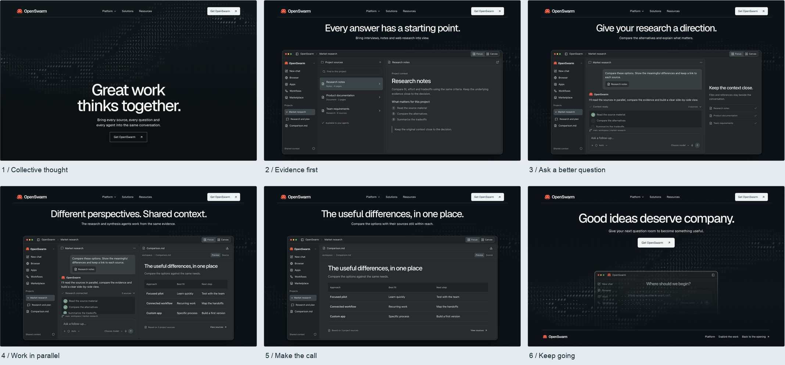

**Composition:** A vast character flock crosses the upper field. A low, centered headline belongs to the dark negative space beneath it.

**Reference foundation:** Capy / Speakeasy. Actual glyph artwork; OpenSwarm tool groups and evidence tables.

**Motion direction:** The character field parts around the work, then gathers at the evidence that matters.

**Palette:** #0c1013 · #f1f1e9 · #819b9b

### 1. Collective thought

**Great work thinks together.**

A vast character flock crosses the upper field. A low, centered headline belongs to the dark negative space beneath it.

Motion: Thousands of individual glyphs travel across a dense, continuous flock; the copy stays still.

Review action: Continue into the product story. [Open scene](http://localhost:5173/?direction=night&frame=1)

### 2. Evidence first

**Every answer has a starting point.**

Bring interviews, notes and web research into view.

Motion: Source rows reveal in order; the glyph field shifts toward the active source.

Review action: Select a source and inspect its content. [Open scene](http://localhost:5173/?direction=night&frame=2)

### 3. Ask a better question

**Give your research a direction.**

Compare the alternatives and explain what matters.

Motion: A legible tool group opens under the request; the input remains fixed.

Review action: Run the comparison example. [Open scene](http://localhost:5173/?direction=night&frame=3)

### 4. Work in parallel

**Different perspectives. Shared context.**

The research and synthesis agents work from the same evidence.

Motion: Dark panes separate horizontally as connecting lines clarify their relationship.

Review action: Focus either side of the workspace. [Open scene](http://localhost:5173/?direction=night&frame=4)

### 5. Make the call

**The useful differences, in one place.**

Compare the options with their sources still within reach.

Motion: A bright table resolves against the dark field, without replacing the workspace.

Review action: Inspect the comparison table. [Open scene](http://localhost:5173/?direction=night&frame=5)

### 6. Keep going

**Good ideas deserve company.**

Give your next question room to become something useful.

Motion: The character wave settles around a single centered call to action.

Review action: Return to the first question. [Open scene](http://localhost:5173/?direction=night&frame=6)

## 03 / Living Form

Spectral paper becomes a consistent framing material: opening, source collection, workspace and closing all belong to the same identity.

[Open this direction](http://localhost:5173/?direction=living) · [Full storyboard image](media/board-03-living.jpg)

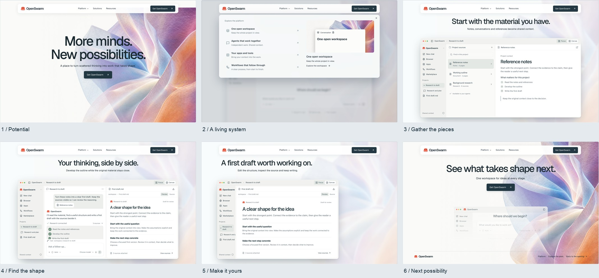

**Composition:** An oversized spectral paper form fills the lower-right field. The centered headline and open paper space carry the opening without an app window.

**Reference foundation:** Meristem. Native file tabs; Cohere’s large product details.

**Motion direction:** The artwork unfolds at the edges while native tabs expand into a document spread.

**Palette:** #fafaf8 · #26262b · #b6c3ee · #dfb9da

### 1. Potential

**More minds. New possibilities.**

An oversized spectral paper form fills the lower-right field. The centered headline and open paper space carry the opening without an app window.

Motion: The filmed paper form slowly unfolds; its framing material returns around the later native workspace.

Review action: Continue into the product story. [Open scene](http://localhost:5173/?direction=living&frame=1)

### 2. A living system

**Tools that belong together.**

Explore the canvas, agents and apps as one connected product.

Motion: The island navigation grows into a two-column product index with a spectral preview.

Review action: Try the interactive mega menu. [Open scene](http://localhost:5173/?direction=living&frame=2)

### 3. Gather the pieces

**Start with the material you have.**

Notes, conversations and references become shared context.

Motion: Files slide into a single native source drawer instead of floating as decorative cards.

Review action: Inspect the source drawer. [Open scene](http://localhost:5173/?direction=living&frame=3)

### 4. Find the shape

**Your thinking, side by side.**

Develop the outline while the original material stays close.

Motion: The native window widens into a joined conversation and document spread.

Review action: Toggle Focus and Canvas. [Open scene](http://localhost:5173/?direction=living&frame=4)

### 5. Make it yours

**A first draft worth working on.**

Edit the structure, inspect the source and keep writing.

Motion: The document surface comes forward; soft optical material frames its edges.

Review action: Switch between document and source. [Open scene](http://localhost:5173/?direction=living&frame=5)

### 6. Next possibility

**See what takes shape next.**

One workspace for ideas at every stage.

Motion: The fold opens wider around a compact footer and centered action.

Review action: Start again. [Open scene](http://localhost:5173/?direction=living&frame=6)

## 04 / Common Ground

Large confident typography frames real work. The visual system comes from the product’s layout, with no ornamental environment.

[Open this direction](http://localhost:5173/?direction=common) · [Full storyboard image](media/board-04-common.jpg)

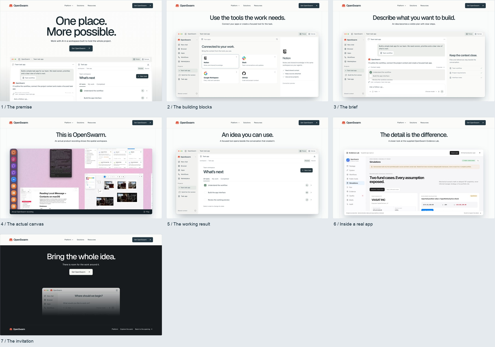

**Composition:** Oversized centered typography hands directly into a broad native conversation and working task app.

**Reference foundation:** Cohere / native OpenSwarm. Expanding media from supplied motion references; readable native interface scale. Supplied Evidence Lab: dense, legible panels and a visible relationship between sources and results.

**Motion direction:** A typographic opening gives way to a large product window; tabs become full work surfaces.

**Palette:** #fbfbfa · #18191b · #d9dadb

### 1. The premise

**One place. More possible.**

Oversized centered typography hands directly into a broad native conversation and working task app.

Motion: The shared window expands under the headline; tabs and the task state remain interactive.

Review action: Explore the native product surface. [Open scene](http://localhost:5173/?direction=common&frame=1)

### 2. The building blocks

**Use the tools the work needs.**

Connect your apps or create a focused tool for the task.

Motion: A native app library expands under the headline; selecting an app changes the detail pane.

Review action: Choose an app. [Open scene](http://localhost:5173/?direction=common&frame=2)

### 3. The brief

**Describe what you want to build.**

An idea becomes a visible plan with clear steps.

Motion: The supplied ToolUI Plan updates as the request moves forward.

Review action: Run the sample build. [Open scene](http://localhost:5173/?direction=common&frame=3)

### 4. The actual canvas

**This is OpenSwarm.**

An actual product recording shows the spatial workspace.

Motion: The full-width recording takes over the page at readable scale.

Review action: Play or pause the native recording. [Open scene](http://localhost:5173/?direction=common&frame=4)

### 5. The working result

**An idea you can use.**

A focused tool opens beside the conversation that created it.

Motion: The browser preview expands in place, keeping its tabs and controls.

Review action: Interact with the sample app. [Open scene](http://localhost:5173/?direction=common&frame=5)

### 6. Inside a real app

**The detail is the difference.**

A closer look at the supplied OpenSwarm Evidence Lab.

Motion: The actual app capture opens at a useful scale. Switch between the two supplied views and scroll through the interface.

Review action: Inspect both supplied Evidence Lab views. [Open scene](http://localhost:5173/?direction=common&frame=6)

### 7. The invitation

**Bring the whole idea.**

There is room for the work around it.

Motion: A crisp black closing section uses a small brand mark and useful navigation.

Review action: Return to the beginning. [Open scene](http://localhost:5173/?direction=common&frame=7)

## 05 / Monument

The architectural opening is a mechanism: it frames the product, guides expansion, and returns in the closing composition.

[Open this direction](http://localhost:5173/?direction=monument) · [Full storyboard image](media/board-05-monument.jpg)

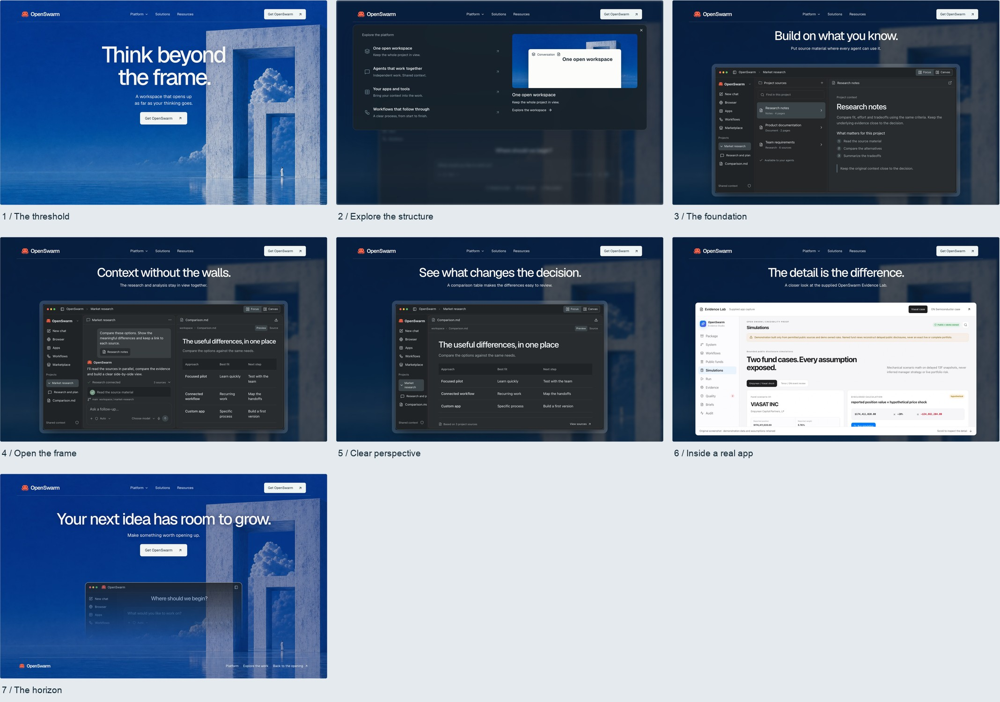

**Composition:** A monumental cobalt portal occupies the entire composition. Centered type crosses the sky, with an unobstructed architectural foreground.

**Reference foundation:** Cobalt Dither Monumentalism. Tasklify’s clear foreground; native OpenSwarm table and context anatomy. Supplied Evidence Lab: dense, legible panels and a visible relationship between sources and results.

**Motion direction:** A rectangular aperture reveals the workspace through a depth-of-field transition; every UI surface remains straight.

**Palette:** #143ba6 · #eff2fa · #111d55

### 1. The threshold

**Think beyond the frame.**

A monumental cobalt portal occupies the entire composition. Centered type crosses the sky, with an unobstructed architectural foreground.

Motion: A slow optical push towards the portal sets up the aperture reveal in the next product chapter.

Review action: Continue into the product story. [Open scene](http://localhost:5173/?direction=monument&frame=1)

### 2. Explore the structure

**One platform. Many ways in.**

Find the right entry point for the work you want to do.

Motion: A wide menu aligns to the portal’s edges, with a useful product preview.

Review action: Explore the platform menu. [Open scene](http://localhost:5173/?direction=monument&frame=2)

### 3. The foundation

**Build on what you know.**

Put source material where every agent can use it.

Motion: The source library occupies the opening, with one large document preview.

Review action: Open a source. [Open scene](http://localhost:5173/?direction=monument&frame=3)

### 4. Open the frame

**Context without the walls.**

The research and analysis stay in view together.

Motion: The aperture widens into a full workspace; a soft foreground blur clears at the edges.

Review action: Switch workspace views. [Open scene](http://localhost:5173/?direction=monument&frame=4)

### 5. Clear perspective

**See what changes the decision.**

A comparison table makes the differences easy to review.

Motion: The table expands to the center, framed by the architecture instead of boxed over it.

Review action: Inspect the result. [Open scene](http://localhost:5173/?direction=monument&frame=5)

### 6. Inside a real app

**The detail is the difference.**

A closer look at the supplied OpenSwarm Evidence Lab.

Motion: The actual app capture opens at a useful scale. Switch between the two supplied views and scroll through the interface.

Review action: Inspect both supplied Evidence Lab views. [Open scene](http://localhost:5173/?direction=monument&frame=6)

### 7. The horizon

**Your next idea has room to grow.**

Make something worth opening up.

Motion: The product lowers, revealing the same open horizon beneath a centered action.

Review action: Return to the opening. [Open scene](http://localhost:5173/?direction=monument&frame=7)

## 06 / Signal Atlas

A populated evidence map replaces the empty cartography. Labeled sources and useful product details give the graphic a reason to exist.

[Open this direction](http://localhost:5173/?direction=signal) · [Full storyboard image](media/board-06-signal.jpg)

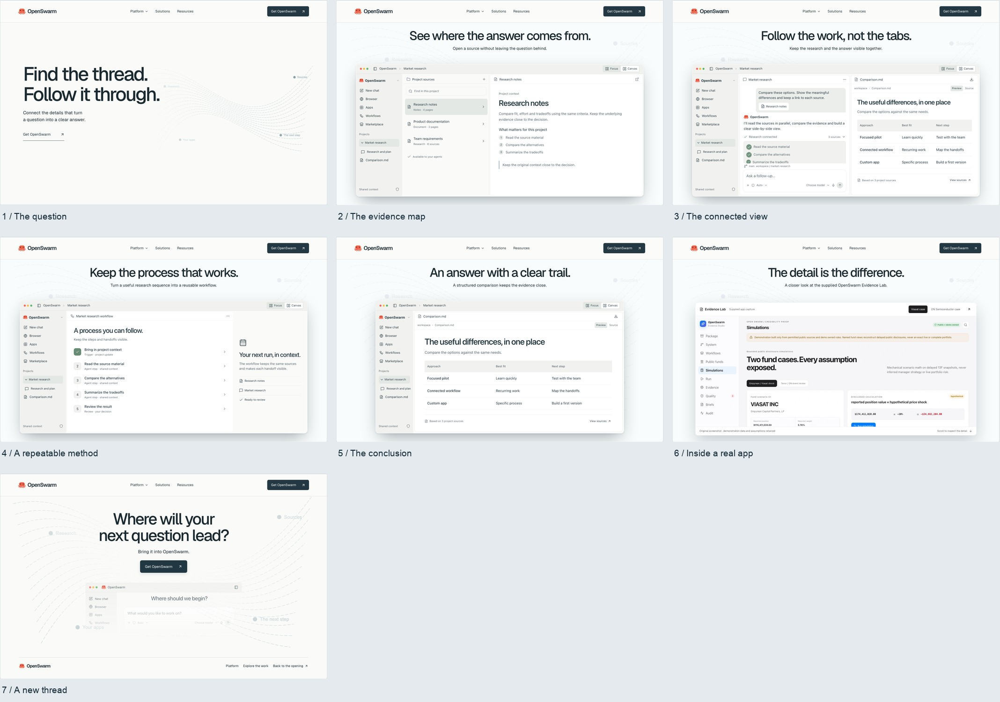

**Composition:** An asymmetric editorial opening: a clear statement at left, a large populated source diagram at right.

**Reference foundation:** Cohere line drawings / OpenSwarm tethers. Speakeasy’s character precision, without decorative typewriter captions. Supplied Evidence Lab: dense, legible panels and a visible relationship between sources and results.

**Motion direction:** Selecting a source traces its path into the active answer, making context visible.

**Palette:** #fcfcfb · #233538 · #acc4c5

### 1. The question

**Find the thread. Follow it through.**

An asymmetric editorial opening: a clear statement at left, a large populated source diagram at right.

Motion: Lines travel between named source points. The graphic becomes source inspection in the next chapter.

Review action: Continue into the product story. [Open scene](http://localhost:5173/?direction=signal&frame=1)

### 2. The evidence map

**See where the answer comes from.**

Open a source without leaving the question behind.

Motion: A selected connection brightens and its source opens in the adjacent pane.

Review action: Select an evidence source. [Open scene](http://localhost:5173/?direction=signal&frame=2)

### 3. The connected view

**Follow the work, not the tabs.**

Keep the research and the answer visible together.

Motion: The map contracts into the edges of a joined native workspace.

Review action: Change workspace views. [Open scene](http://localhost:5173/?direction=signal&frame=3)

### 4. A repeatable method

**Keep the process that works.**

Turn a useful research sequence into a reusable workflow.

Motion: A source-to-analysis timeline expands vertically into editable steps.

Review action: Toggle workflow steps. [Open scene](http://localhost:5173/?direction=signal&frame=4)

### 5. The conclusion

**An answer with a clear trail.**

A structured comparison keeps the evidence close.

Motion: The table comes forward while source connections remain visible at its edge.

Review action: Inspect the comparison. [Open scene](http://localhost:5173/?direction=signal&frame=5)

### 6. Inside a real app

**The detail is the difference.**

A closer look at the supplied OpenSwarm Evidence Lab.

Motion: The actual app capture opens at a useful scale. Switch between the two supplied views and scroll through the interface.

Review action: Inspect both supplied Evidence Lab views. [Open scene](http://localhost:5173/?direction=signal&frame=6)

### 7. A new thread

**Where will your next question lead?**

Bring it into OpenSwarm.

Motion: The linework converges around a centered prompt, with a clean compact footer.

Review action: Start a new question. [Open scene](http://localhost:5173/?direction=signal&frame=7)

## 07 / Afterglow

Retain the dark coast, but add a complete native product story and deliberate focus transitions so the atmosphere carries useful work.

[Open this direction](http://localhost:5173/?direction=afterglow) · [Full storyboard image](media/board-07-afterglow.jpg)

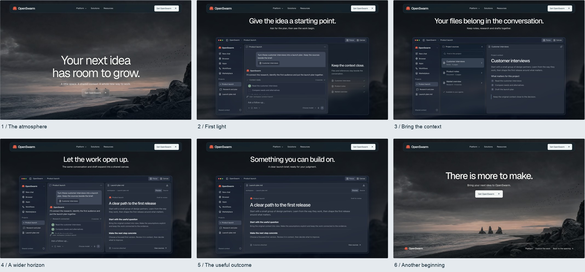

**Composition:** An uninterrupted dark coastal film. The centered invitation sits low against the dusk, leaving most of the scene to breathe.

**Reference foundation:** Nexora / Capy. OpenSwarm’s dark neutral surfaces; the sampled anchored workspace transitions. Spatial UI references: layered translucent chrome, detached rails, and soft depth around front-facing native content.

**Motion direction:** The scene stays alive while a translucent outer frame brings the dark native workspace into focus.

**Palette:** #111719 · #f4f4ec · #8a9b9f

### 1. The atmosphere

**Your next idea has room to grow.**

An uninterrupted dark coastal film. The centered invitation sits low against the dusk, leaving most of the scene to breathe.

Motion: The coast remains alive behind still typography; the next scene brings the first glass product surface into focus.

Review action: Continue into the product story. [Open scene](http://localhost:5173/?direction=afterglow&frame=1)

### 2. First light

**Give the idea a starting point.**

Ask for the plan, then see the work begin.

Motion: The composer opens into chat with the native ToolUI Plan, in a large dark surface.

Review action: Run the sample request. [Open scene](http://localhost:5173/?direction=afterglow&frame=2)

### 3. Bring the context

**Your files belong in the conversation.**

Keep notes, research and drafts together.

Motion: A source drawer slides out from the workspace; the landscape behind it softens.

Review action: Inspect project sources. [Open scene](http://localhost:5173/?direction=afterglow&frame=3)

### 4. A wider horizon

**Let the work open up.**

The same conversation and draft expand into a shared canvas.

Motion: The outer glass frame widens; the two opaque reading surfaces remain straight and legible.

Review action: Toggle Focus and Canvas. [Open scene](http://localhost:5173/?direction=afterglow&frame=4)

### 5. The useful outcome

**Something you can build on.**

A clear launch brief, ready for your judgment.

Motion: The finished brief brightens against the dark scene while the chat remains nearby.

Review action: Read or download the brief. [Open scene](http://localhost:5173/?direction=afterglow&frame=5)

### 6. Another beginning

**There is more to make.**

Bring your next idea to OpenSwarm.

Motion: The result recedes into the scene; the horizon and centered action close the story.

Review action: Return to the opening. [Open scene](http://localhost:5173/?direction=afterglow&frame=6)

## 08 / The Estuary

Hand-painted tributaries carry the visual metaphor from scattered sources to one clear document, using paper-native product surfaces.

[Open this direction](http://localhost:5173/?direction=estuary) · [Full storyboard image](media/board-08-estuary.jpg)

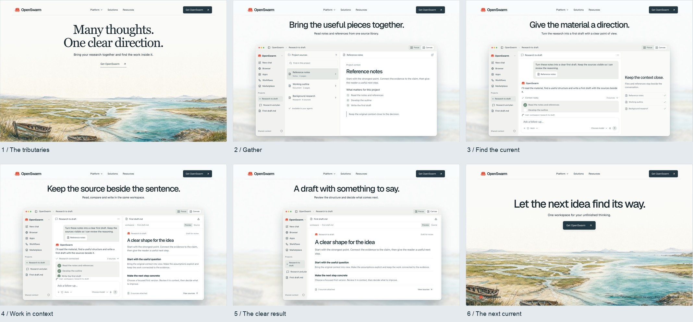

**Composition:** A restrained serif headline across the top, a full painted estuary below. No interface covers the water.

**Reference foundation:** SEOmade watercolor footer. Tasklify product hierarchy; the native file drawer.

**Motion direction:** The painted edge dissolves into a full document surface; sources gather along one side.

**Palette:** #fbfaf5 · #243e3d · #9dbbb6

### 1. The tributaries

**Many thoughts. One clear direction.**

A restrained serif headline across the top, a full painted estuary below. No interface covers the water.

Motion: Painted edges soften into the page, then give way to the source collection in the next chapter.

Review action: Continue into the product story. [Open scene](http://localhost:5173/?direction=estuary&frame=1)

### 2. Gather

**Bring the useful pieces together.**

Read notes and references from one source library.

Motion: Sources move into a single orderly drawer, while the illustration continues outside the app.

Review action: Choose a source. [Open scene](http://localhost:5173/?direction=estuary&frame=2)

### 3. Find the current

**Give the material a direction.**

Turn the research into a first draft with a clear point of view.

Motion: A native response appears above the task plan, without decorative typing.

Review action: Run the writing example. [Open scene](http://localhost:5173/?direction=estuary&frame=3)

### 4. Work in context

**Keep the source beside the sentence.**

Read, compare and write in the same workspace.

Motion: The page opens like a spread, with a narrow context rail and large editable result.

Review action: Inspect the shared workspace. [Open scene](http://localhost:5173/?direction=estuary&frame=4)

### 5. The clear result

**A draft with something to say.**

Review the structure and decide what comes next.

Motion: The painted surroundings soften as the document moves into focus.

Review action: Download the draft. [Open scene](http://localhost:5173/?direction=estuary&frame=5)

### 6. The next current

**Let the next idea find its way.**

One workspace for your unfinished thinking.

Motion: The same watercolor becomes the footer edge, with useful links and no giant wordmark.

Review action: Return to the opening. [Open scene](http://localhost:5173/?direction=estuary&frame=6)

## 09 / Other Skies

Different work surfaces occupy one inhabited landscape. Portals organize depth without tilting or shrinking the actual interface.

[Open this direction](http://localhost:5173/?direction=skies) · [Full storyboard image](media/board-09-skies.jpg)

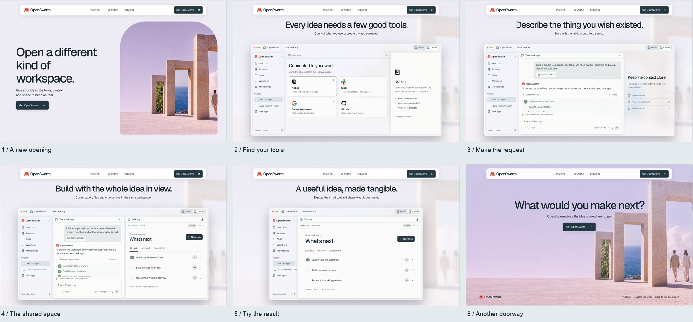

**Composition:** A pale-lilac editorial split: generous typography at left and a tall architectural image aperture at right.

**Reference foundation:** Decagon / Meristem. Native browser and app surfaces; spatial continuity from the video references. Spatial UI references: layered translucent chrome, detached rails, and soft depth around front-facing native content.

**Motion direction:** Doorway-shaped masks open into full native panes; an app preview comes through the center.

**Palette:** #dad8f2 · #252441 · #c1bfdc

### 1. A new opening

**Open a different kind of workspace.**

A pale-lilac editorial split: generous typography at left and a tall architectural image aperture at right.

Motion: The image aperture opens vertically before the site introduces its tools.

Review action: Continue into the product story. [Open scene](http://localhost:5173/?direction=skies&frame=1)

### 2. Find your tools

**Every idea needs a few good tools.**

Connect what you use or create the app you need.

Motion: A native app grid fills the portal; selecting an app brings its details forward.

Review action: Inspect an app. [Open scene](http://localhost:5173/?direction=skies&frame=2)

### 3. Make the request

**Describe the thing you wish existed.**

Start with the job it should help you do.

Motion: The conversation opens from the composer into a large foreground window.

Review action: Run the app-building example. [Open scene](http://localhost:5173/?direction=skies&frame=3)

### 4. The shared space

**Build with the whole idea in view.**

Conversation, files and browser live in the same workspace.

Motion: The foreground window widens; a browser opens beside it at full reading scale.

Review action: Switch workspace layouts. [Open scene](http://localhost:5173/?direction=skies&frame=4)

### 5. Try the result

**A useful idea, made tangible.**

Explore the small tool and shape what it does next.

Motion: The browser preview expands through the center aperture.

Review action: Use the sample task app. [Open scene](http://localhost:5173/?direction=skies&frame=5)

### 6. Another doorway

**What would you make next?**

OpenSwarm gives the idea somewhere to go.

Motion: The scene returns to its architectural depth around a centered action.

Review action: Start again. [Open scene](http://localhost:5173/?direction=skies&frame=6)

## 10 / White Threshold

White architecture and blue reflections create a structured light direction. A full product window fits the opening with architectural precision.

[Open this direction](http://localhost:5173/?direction=threshold) · [Full storyboard image](media/board-10-threshold.jpg)

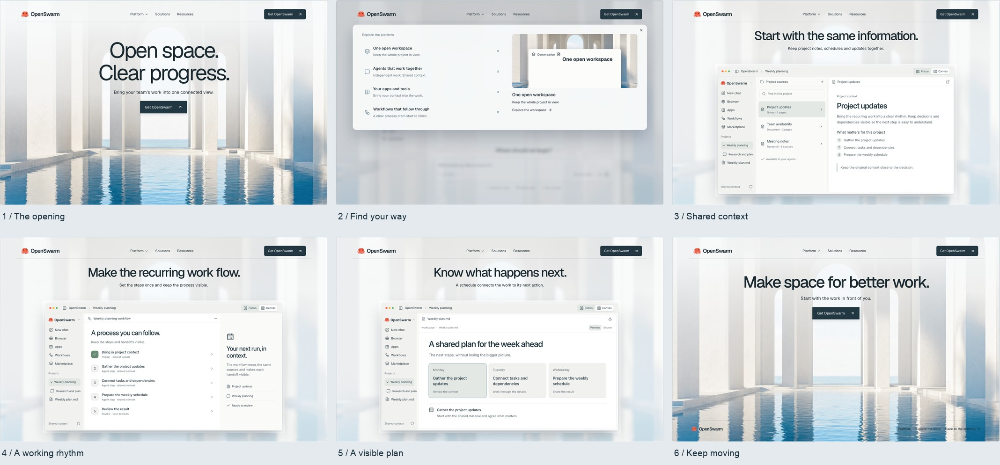

**Composition:** Symmetric white architecture and a centered statement, set in a quiet strip above the reflecting water.

**Reference foundation:** Cobalt monument reference / Cohere. Nexora’s section pacing; native workflow steps.

**Motion direction:** Horizontal shutters uncover a workflow, then reveal its result at the same anchor point.

**Palette:** #f8fafb · #1d3445 · #a3bbd1

### 1. The opening

**Open space. Clear progress.**

Symmetric white architecture and a centered statement, set in a quiet strip above the reflecting water.

Motion: The architectural view gently moves forward while the headline stays pinned to the page.

Review action: Continue into the product story. [Open scene](http://localhost:5173/?direction=threshold&frame=1)

### 2. Find your way

**A clear path into the platform.**

Choose a capability by the job you want to do.

Motion: The navigation opens into an architectural grid with product previews.

Review action: Explore the mega menu. [Open scene](http://localhost:5173/?direction=threshold&frame=2)

### 3. Shared context

**Start with the same information.**

Keep project notes, schedules and updates together.

Motion: A clear source drawer expands within the window, not over the landscape.

Review action: Read a project source. [Open scene](http://localhost:5173/?direction=threshold&frame=3)

### 4. A working rhythm

**Make the recurring work flow.**

Set the steps once and keep the process visible.

Motion: A vertical workflow reveals each handoff as one connected sequence.

Review action: Toggle workflow steps. [Open scene](http://localhost:5173/?direction=threshold&frame=4)

### 5. A visible plan

**Know what happens next.**

A schedule connects the work to its next action.

Motion: The schedule expands into the same central window with a soft contextual blur.

Review action: Inspect the schedule. [Open scene](http://localhost:5173/?direction=threshold&frame=5)

### 6. Keep moving

**Make space for better work.**

Start with the work in front of you.

Motion: The product recedes into the white opening; a compact footer follows the reflection line.

Review action: Return to the first scene. [Open scene](http://localhost:5173/?direction=threshold&frame=6)

## 11 / Current

An optical current leads the eye into a wide native workspace. The imagery has a physical relationship to the active pane.

[Open this direction](http://localhost:5173/?direction=current) · [Full storyboard image](media/board-11-current.jpg)

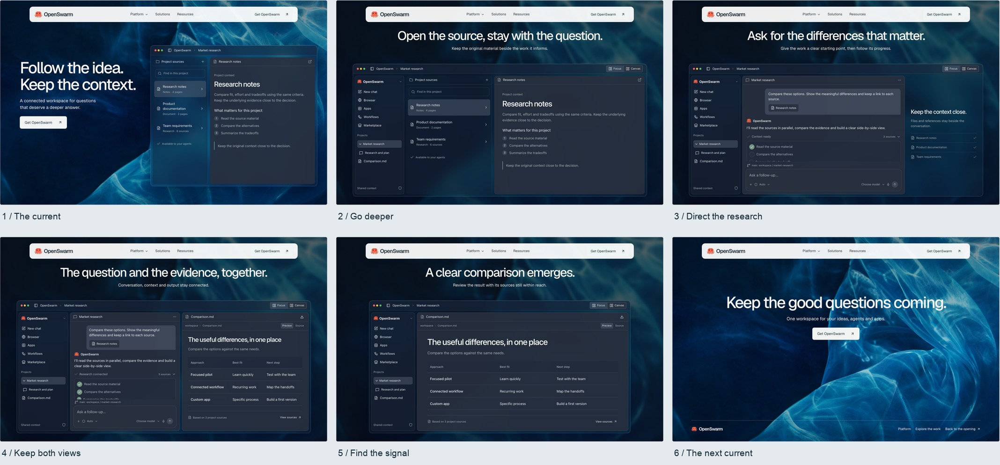

**Composition:** A left-aligned statement beside a large, front-facing native source reader. Cyan optical material connects both halves.

**Reference foundation:** Meristem / Cohere. Spectral material with a crisp dark native interface. Spatial UI references: layered translucent chrome, detached rails, and soft depth around front-facing native content.

**Motion direction:** A fluid mask uncovers the source drawer; the workspace stays fixed while its reading focus changes.

**Palette:** #10171c · #f4f5f6 · #82aab7

### 1. The current

**Follow the idea. Keep the context.**

A left-aligned statement beside a large, front-facing native source reader. Cyan optical material connects both halves.

Motion: The selected source changes within the reader, while the surrounding material shifts in soft focus.

Review action: Explore the native product surface. [Open scene](http://localhost:5173/?direction=current&frame=1)

### 2. Go deeper

**Open the source, stay with the question.**

Keep the original material beside the work it informs.

Motion: The source drawer pushes the conversation aside, keeping both readable.

Review action: Select and inspect a source. [Open scene](http://localhost:5173/?direction=current&frame=2)

### 3. Direct the research

**Ask for the differences that matter.**

Give the work a clear starting point, then follow its progress.

Motion: A compact native tool group expands into a structured comparison plan.

Review action: Run the sample request. [Open scene](http://localhost:5173/?direction=current&frame=3)

### 4. Keep both views

**The question and the evidence, together.**

Conversation, context and output stay connected.

Motion: The workspace divides along the curve of the background while panes stay rectangular.

Review action: Switch Focus and Canvas. [Open scene](http://localhost:5173/?direction=current&frame=4)

### 5. Find the signal

**A clear comparison emerges.**

Review the result with its sources still within reach.

Motion: The result table takes focus; the source column stays attached.

Review action: Explore or download the result. [Open scene](http://localhost:5173/?direction=current&frame=5)

### 6. The next current

**Keep the good questions coming.**

One workspace for your ideas, agents and apps.

Motion: The optical field passes behind a centered closing action and compact footer.

Review action: Return to the opening. [Open scene](http://localhost:5173/?direction=current&frame=6)

## 12 / Greenways

A rich landscape forms a broad lower stage while crisp white typography and product chapters supply structure.

[Open this direction](http://localhost:5173/?direction=greenways) · [Full storyboard image](media/board-12-greenways.jpg)

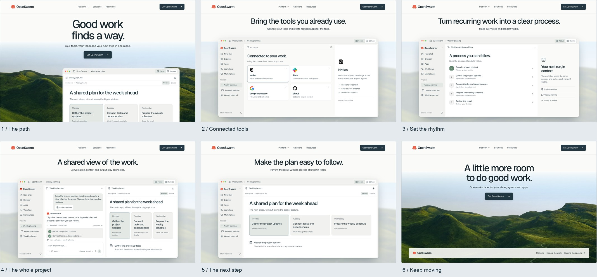

**Composition:** A bright centered introduction above a panoramic green landscape. One large document sits on the right of the lower scene.

**Reference foundation:** Cohere North. Tasklify’s centered clarity; native workflow surfaces.

**Motion direction:** A landscape reveal follows the first scroll; workflow steps align with the visual path.

**Palette:** #fafbf9 · #243333 · #a8bfcd

### 1. The path

**Good work finds a way.**

A bright centered introduction above a panoramic green landscape. One large document sits on the right of the lower scene.

Motion: The document rises from the landscape and expands into the review chapter.

Review action: Explore the native product surface. [Open scene](http://localhost:5173/?direction=greenways&frame=1)

### 2. Connected tools

**Bring the tools you already use.**

Connect your tools and create focused apps for the task.

Motion: The app library opens in a full-width white section, with a focused detail rail.

Review action: Select an app and inspect its details. [Open scene](http://localhost:5173/?direction=greenways&frame=2)

### 3. Set the rhythm

**Turn recurring work into a clear process.**

Make every step and handoff visible.

Motion: Steps reveal along one vertical line with visible state changes.

Review action: Toggle a workflow step. [Open scene](http://localhost:5173/?direction=greenways&frame=3)

### 4. The whole project

**A shared view of the work.**

Conversation, context and output stay connected.

Motion: The workflow opens beside the conversation in a large unified shell.

Review action: Switch Focus and Canvas. [Open scene](http://localhost:5173/?direction=greenways&frame=4)

### 5. The next step

**Make the plan easy to follow.**

Review the result with its sources still within reach.

Motion: A clear schedule moves forward while the green landscape softens behind it.

Review action: Explore or download the result. [Open scene](http://localhost:5173/?direction=greenways&frame=5)

### 6. Keep moving

**A little more room to do good work.**

One workspace for your ideas, agents and apps.

Motion: The landscape returns beneath centered copy and an understated footer.

Review action: Return to the opening. [Open scene](http://localhost:5173/?direction=greenways&frame=6)

## 13 / Higher Ground

Cloud depth provides atmosphere while large, straight native windows establish clarity. Glass belongs to outer framing only.

[Open this direction](http://localhost:5173/?direction=higher) · [Full storyboard image](media/board-13-higher.jpg)

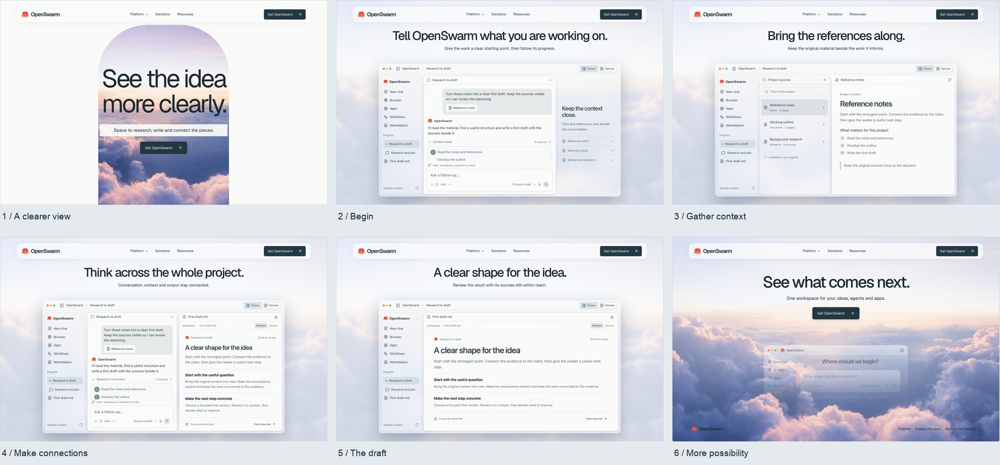

**Composition:** Clouds fill a tall central image aperture. Typography stretches across its edges, creating a poster-like opening.

**Reference foundation:** Tasklify cloud world / Cohere. Meristem’s continuity through imagery and framing. Spatial UI references: layered translucent chrome, detached rails, and soft depth around front-facing native content.

**Motion direction:** A foreground cloud veil clears from the app; the same document grows through the story.

**Palette:** #fafbf9 · #243333 · #a8bfcd

### 1. A clearer view

**See the idea more clearly.**

Clouds fill a tall central image aperture. Typography stretches across its edges, creating a poster-like opening.

Motion: A slow upward drift through the cloud field precedes the native workspace.

Review action: Continue into the product story. [Open scene](http://localhost:5173/?direction=higher&frame=1)

### 2. Begin

**Tell OpenSwarm what you are working on.**

Give the work a clear starting point, then follow its progress.

Motion: The app rises vertically from the cloud edge with no perspective tilt.

Review action: Run the sample request. [Open scene](http://localhost:5173/?direction=higher&frame=2)

### 3. Gather context

**Bring the references along.**

Keep the original material beside the work it informs.

Motion: A native source list and full preview replace floating decorative files.

Review action: Select and inspect a source. [Open scene](http://localhost:5173/?direction=higher&frame=3)

### 4. Make connections

**Think across the whole project.**

Conversation, context and output stay connected.

Motion: The shared window expands horizontally into a generous two-pane workspace.

Review action: Switch Focus and Canvas. [Open scene](http://localhost:5173/?direction=higher&frame=4)

### 5. The draft

**A clear shape for the idea.**

Review the result with its sources still within reach.

Motion: The document comes forward while the cloud field remains soft and distant.

Review action: Explore or download the result. [Open scene](http://localhost:5173/?direction=higher&frame=5)

### 6. More possibility

**See what comes next.**

One workspace for your ideas, agents and apps.

Motion: Clouds open around a centered action and a restrained practical footer.

Review action: Return to the opening. [Open scene](http://localhost:5173/?direction=higher&frame=6)

## 14 / Black Glass

Dark architectural planes and a single luminous opening create a strong frame for a usable app-building story.

[Open this direction](http://localhost:5173/?direction=blackglass) · [Full storyboard image](media/board-14-blackglass.jpg)

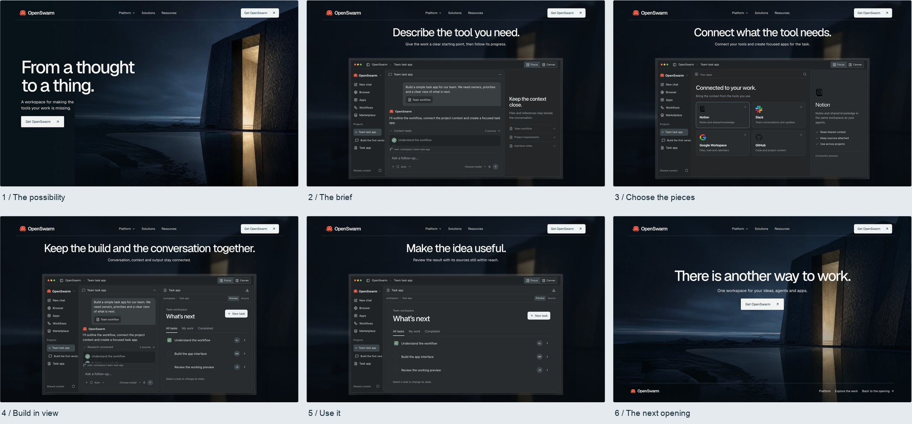

**Composition:** A dark architectural film-still composition: oversized type on the left, a distant illuminated doorway on the right.

**Reference foundation:** Cobalt architecture / Capy. Native browser panes and source-preserving transitions.

**Motion direction:** A hard rectangular mask opens around the product; soft blur separates the environment from the working app.

**Palette:** #10171c · #f4f5f6 · #82aab7

### 1. The possibility

**From a thought to a thing.**

A dark architectural film-still composition: oversized type on the left, a distant illuminated doorway on the right.

Motion: The doorway slowly sharpens as the page draws closer; the native workflow appears later.

Review action: Continue into the product story. [Open scene](http://localhost:5173/?direction=blackglass&frame=1)

### 2. The brief

**Describe the tool you need.**

Give the work a clear starting point, then follow its progress.

Motion: The request develops into the real supplied ToolUI Plan at reading scale.

Review action: Run the sample request. [Open scene](http://localhost:5173/?direction=blackglass&frame=2)

### 3. Choose the pieces

**Connect what the tool needs.**

Connect your tools and create focused apps for the task.

Motion: App details appear beside the library instead of in a modal pile.

Review action: Select an app and inspect its details. [Open scene](http://localhost:5173/?direction=blackglass&frame=3)

### 4. Build in view

**Keep the build and the conversation together.**

Conversation, context and output stay connected.

Motion: The browser expands beside the chat in a stable native split layout.

Review action: Switch Focus and Canvas. [Open scene](http://localhost:5173/?direction=blackglass&frame=4)

### 5. Use it

**Make the idea useful.**

Review the result with its sources still within reach.

Motion: The sample task app takes over the opening, with working controls.

Review action: Explore or download the result. [Open scene](http://localhost:5173/?direction=blackglass&frame=5)

### 6. The next opening

**There is another way to work.**

One workspace for your ideas, agents and apps.

Motion: The dark threshold stays present around a small centered closing action.

Review action: Return to the opening. [Open scene](http://localhost:5173/?direction=blackglass&frame=6)

## 15 / Aperture

The website’s main frame behaves like the product: it opens, divides, reunites and brings the result into focus.

[Open this direction](http://localhost:5173/?direction=aperture) · [Full storyboard image](media/board-15-aperture.jpg)

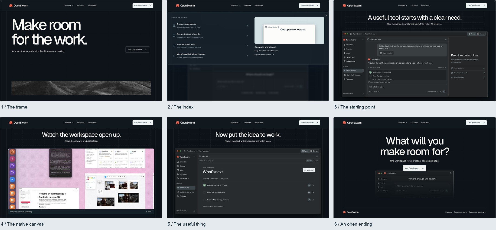

**Composition:** A black typographic poster with one enormous statement and a narrow horizontal window into the outside world.

**Reference foundation:** Cohere / supplied expanding-panel motion. OpenSwarm layout controls and window anatomy.

**Motion direction:** Black shutters retract into the edges of a single full-scale app frame.

**Palette:** #10171c · #f4f5f6 · #82aab7

### 1. The frame

**Make room for the work.**

A black typographic poster with one enormous statement and a narrow horizontal window into the outside world.

Motion: The narrow image slit widens into the actual OpenSwarm recording in the later chapter.

Review action: Continue into the product story. [Open scene](http://localhost:5173/?direction=aperture&frame=1)

### 2. The index

**Every part of the platform, in view.**

Explore the platform through the work you want to do.

Motion: The solid masthead unfolds into a typographic mega menu and live preview.

Review action: Open the Platform menu. [Open scene](http://localhost:5173/?direction=aperture&frame=2)

### 3. The starting point

**A useful tool starts with a clear need.**

Give the work a clear starting point, then follow its progress.

Motion: The opening frame widens to reveal the composer and a real plan component.

Review action: Run the sample request. [Open scene](http://localhost:5173/?direction=aperture&frame=3)

### 4. The native canvas

**Watch the workspace open up.**

Actual OpenSwarm product footage.

Motion: Actual OpenSwarm footage replaces the illustrative surface within the same frame.

Review action: Play the native product recording. [Open scene](http://localhost:5173/?direction=aperture&frame=4)

### 5. The useful thing

**Now put the idea to work.**

Review the result with its sources still within reach.

Motion: The frame expands into a sample app with working task controls.

Review action: Explore or download the result. [Open scene](http://localhost:5173/?direction=aperture&frame=5)

### 6. An open ending

**What will you make room for?**

One workspace for your ideas, agents and apps.

Motion: A final black frame holds centered copy and a small useful footer.

Review action: Return to the opening. [Open scene](http://localhost:5173/?direction=aperture&frame=6)

## 16 / Crossfade

A two-part composition becomes one reading surface. Spectral material links the sections without washing over the native interface.

[Open this direction](http://localhost:5173/?direction=crossfade) · [Full storyboard image](media/board-16-crossfade.jpg)

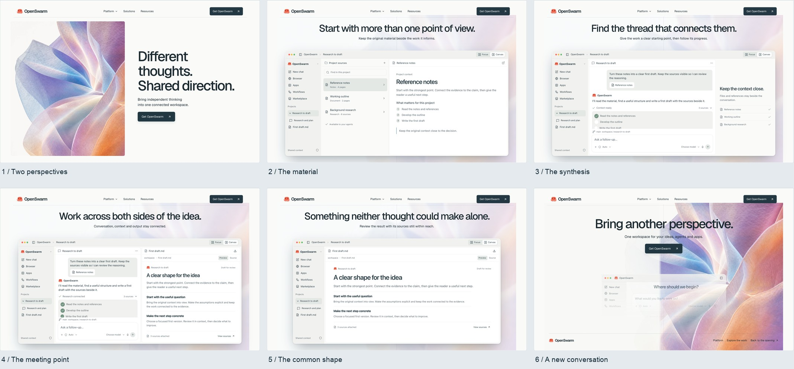

**Composition:** Two deliberately different halves: spectral material in a tall panel at left and a clean typographic introduction at right.

**Reference foundation:** Meristem / Cohere split compositions. Native joined conversation and document views.

**Motion direction:** Two image fields slide apart as two native workspaces meet at a shared edge.

**Palette:** #fafbf9 · #243333 · #a8bfcd

### 1. Two perspectives

**Different thoughts. Shared direction.**

Two deliberately different halves: spectral material in a tall panel at left and a clean typographic introduction at right.

Motion: The material crosses the central seam as the next chapter changes from references to writing.

Review action: Continue into the product story. [Open scene](http://localhost:5173/?direction=crossfade&frame=1)

### 2. The material

**Start with more than one point of view.**

Keep the original material beside the work it informs.

Motion: The source drawer provides a clear switch between references.

Review action: Select and inspect a source. [Open scene](http://localhost:5173/?direction=crossfade&frame=2)

### 3. The synthesis

**Find the thread that connects them.**

Give the work a clear starting point, then follow its progress.

Motion: A writing request opens into a structured native plan and visible source group.

Review action: Run the sample request. [Open scene](http://localhost:5173/?direction=crossfade&frame=3)

### 4. The meeting point

**Work across both sides of the idea.**

Conversation, context and output stay connected.

Motion: The two surfaces meet as one joined workspace with a shared header.

Review action: Switch Focus and Canvas. [Open scene](http://localhost:5173/?direction=crossfade&frame=4)

### 5. The common shape

**Something neither thought could make alone.**

Review the result with its sources still within reach.

Motion: The finished document expands across the seam while context stays close.

Review action: Explore or download the result. [Open scene](http://localhost:5173/?direction=crossfade&frame=5)

### 6. A new conversation

**Bring another perspective.**

One workspace for your ideas, agents and apps.

Motion: The diptych reconnects around a centered call to action.

Review action: Return to the opening. [Open scene](http://localhost:5173/?direction=crossfade&frame=6)

## 17 / Relay

The handoff is the visual identity. Labeled connections carry work between native surfaces and make each stage understandable.

[Open this direction](http://localhost:5173/?direction=relay) · [Full storyboard image](media/board-17-relay.jpg)

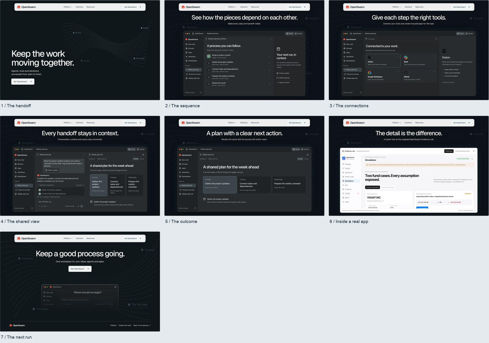

**Composition:** A dark diagram occupies the upper-right field; a grounded headline at lower-left establishes the handoff story.

**Reference foundation:** OpenSwarm tethers / Cohere diagrams. Capy’s integrated dark workspace. Supplied Evidence Lab: dense, legible panels and a visible relationship between sources and results.

**Motion direction:** A traveling connection reaches a pane just as its state changes; motion explains the handoff.

**Palette:** #10171c · #f4f5f6 · #82aab7

### 1. The handoff

**Keep the work moving together.**

A dark diagram occupies the upper-right field; a grounded headline at lower-left establishes the handoff story.

Motion: A visible pulse follows the diagram paths, making the direction of the handoff clear.

Review action: Continue into the product story. [Open scene](http://localhost:5173/?direction=relay&frame=1)

### 2. The sequence

**See how the pieces depend on each other.**

Make every step and handoff visible.

Motion: A native workflow opens with named steps and visible completion states.

Review action: Toggle a workflow step. [Open scene](http://localhost:5173/?direction=relay&frame=2)

### 3. The connections

**Give each step the right tools.**

Connect your tools and create focused apps for the task.

Motion: Selecting an app brings its capabilities into the adjacent detail pane.

Review action: Select an app and inspect its details. [Open scene](http://localhost:5173/?direction=relay&frame=3)

### 4. The shared view

**Every handoff stays in context.**

Conversation, context and output stay connected.

Motion: The workflow and conversation align inside a unified dark window.

Review action: Switch Focus and Canvas. [Open scene](http://localhost:5173/?direction=relay&frame=4)

### 5. The outcome

**A plan with a clear next action.**

Review the result with its sources still within reach.

Motion: The schedule comes forward while the final connection settles beside it.

Review action: Explore or download the result. [Open scene](http://localhost:5173/?direction=relay&frame=5)

### 6. Inside a real app

**The detail is the difference.**

A closer look at the supplied OpenSwarm Evidence Lab.

Motion: The actual app capture opens at a useful scale. Switch between the two supplied views and scroll through the interface.

Review action: Inspect both supplied Evidence Lab views. [Open scene](http://localhost:5173/?direction=relay&frame=6)

### 7. The next run

**Keep a good process going.**

One workspace for your ideas, agents and apps.

Motion: The connected field resolves into one centered action and useful links.

Review action: Return to the opening. [Open scene](http://localhost:5173/?direction=relay&frame=7)

## 18 / Open Folio

Folded paper introduces the identity before the document becomes a working surface. A clean product anatomy gives the later chapters weight.

[Open this direction](http://localhost:5173/?direction=folio) · [Full storyboard image](media/board-18-folio.jpg)

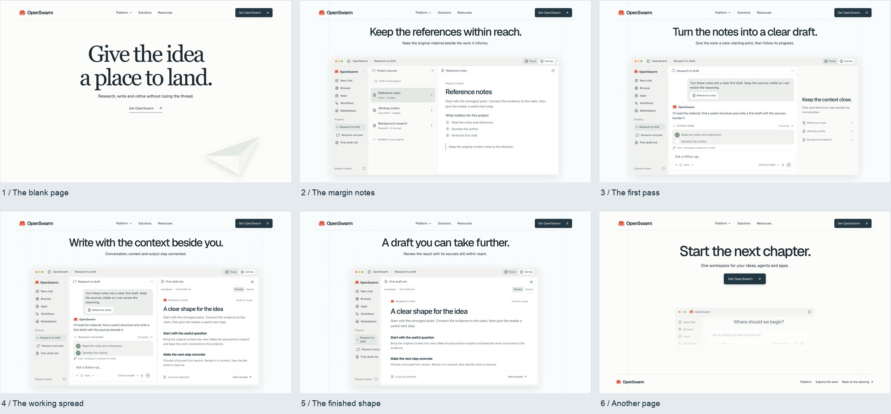

**Composition:** A large editorial serif opening, fine page rules and a small paper-fold illustration. The product is withheld until the source chapter.

**Reference foundation:** Cohere editorial scale / native file view. SEOmade’s restrained white page rhythm.

**Motion direction:** A real document tab unfolds into a full page while the chat stays in the margin.

**Palette:** #fafbf9 · #243333 · #a8bfcd

### 1. The blank page

**Give the idea a place to land.**

A large editorial serif opening, fine page rules and a small paper-fold illustration. The product is withheld until the source chapter.

Motion: The paper fold opens at the margin, establishing the later document spread.

Review action: Continue into the product story. [Open scene](http://localhost:5173/?direction=folio&frame=1)

### 2. The margin notes

**Keep the references within reach.**

Keep the original material beside the work it informs.

Motion: The source drawer opens as a document margin with an adjacent preview.

Review action: Select and inspect a source. [Open scene](http://localhost:5173/?direction=folio&frame=2)

### 3. The first pass

**Turn the notes into a clear draft.**

Give the work a clear starting point, then follow its progress.

Motion: The native plan develops above the composer without moving the page.

Review action: Run the sample request. [Open scene](http://localhost:5173/?direction=folio&frame=3)

### 4. The working spread

**Write with the context beside you.**

Conversation, context and output stay connected.

Motion: The page becomes a generous conversation/document spread.

Review action: Switch Focus and Canvas. [Open scene](http://localhost:5173/?direction=folio&frame=4)

### 5. The finished shape

**A draft you can take further.**

Review the result with its sources still within reach.

Motion: The document expands to a readable full-width focus view.

Review action: Explore or download the result. [Open scene](http://localhost:5173/?direction=folio&frame=5)

### 6. Another page

**Start the next chapter.**

One workspace for your ideas, agents and apps.

Motion: The final page closes into a quiet centered action and compact footer.

Review action: Return to the opening. [Open scene](http://localhost:5173/?direction=folio&frame=6)

## 19 / Aurora

A photographic ribbon of light creates atmosphere around a crisp dark interface. The product is the brightest readable object.

[Open this direction](http://localhost:5173/?direction=aurora) · [Full storyboard image](media/board-19-aurora.jpg)

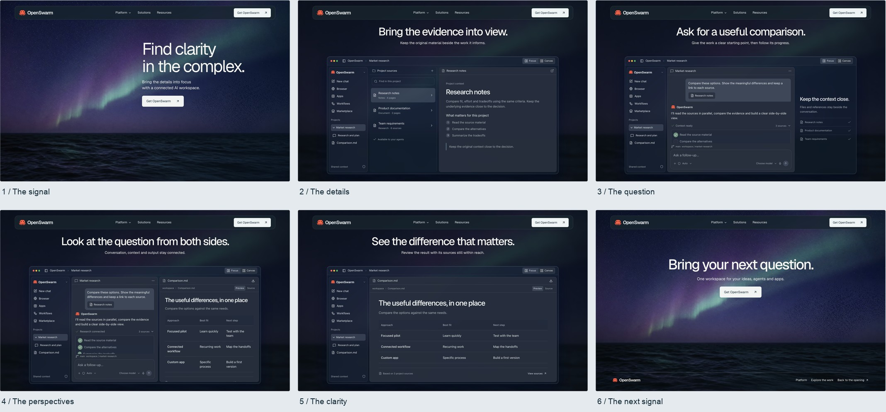

**Composition:** An expansive aurora and ocean, with the headline offset high on the right. The landscape retains the center of gravity.

**Reference foundation:** Nexora / Capy. Meristem’s material continuity and native source panels. Spatial UI references: layered translucent chrome, detached rails, and soft depth around front-facing native content.

**Motion direction:** Focus passes from sources to synthesis as the background light stays continuous.

**Palette:** #10171c · #f4f5f6 · #82aab7

### 1. The signal

**Find clarity in the complex.**

An expansive aurora and ocean, with the headline offset high on the right. The landscape retains the center of gravity.

Motion: The photographic light drifts across the sky with a slow layered movement.

Review action: Continue into the product story. [Open scene](http://localhost:5173/?direction=aurora&frame=1)

### 2. The details

**Bring the evidence into view.**

Keep the original material beside the work it informs.

Motion: A full source preview appears within the native window, with clear selected state.

Review action: Select and inspect a source. [Open scene](http://localhost:5173/?direction=aurora&frame=2)

### 3. The question

**Ask for a useful comparison.**

Give the work a clear starting point, then follow its progress.

Motion: Grouped tool activity opens below the request in a readable dark pane.

Review action: Run the sample request. [Open scene](http://localhost:5173/?direction=aurora&frame=3)

### 4. The perspectives

**Look at the question from both sides.**

Conversation, context and output stay connected.

Motion: The joined workspace reveals research and synthesis without changing anchors.

Review action: Switch Focus and Canvas. [Open scene](http://localhost:5173/?direction=aurora&frame=4)

### 5. The clarity

**See the difference that matters.**

Review the result with its sources still within reach.

Motion: A neutral comparison table takes focus against the photographic light.

Review action: Explore or download the result. [Open scene](http://localhost:5173/?direction=aurora&frame=5)

### 6. The next signal

**Bring your next question.**

One workspace for your ideas, agents and apps.

Motion: The aurora continues above a centered call to action and small footer.

Review action: Return to the opening. [Open scene](http://localhost:5173/?direction=aurora&frame=6)

## 20 / Growing Ideas

Botanical linework gives branching research an organic structure while the actual workspace stays familiar and precise.

[Open this direction](http://localhost:5173/?direction=botanical) · [Full storyboard image](media/board-20-botanical.jpg)

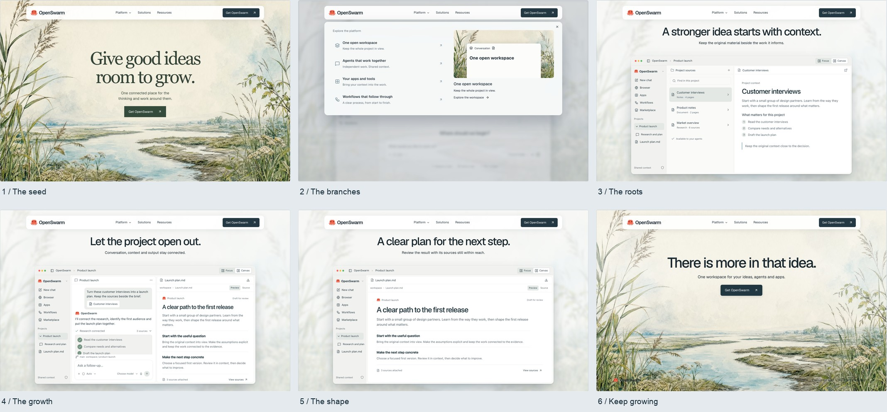

**Composition:** A centered botanical title surrounded by tall painted reeds. The cream paper and illustrated margins form one continuous page.

**Reference foundation:** SEOmade / Meristem. Native shared sources and file tabs.

**Motion direction:** Fine branch strokes meet the source drawer, then withdraw as the document takes focus.

**Palette:** #fafbf9 · #243333 · #a8bfcd

### 1. The seed

**Give good ideas room to grow.**

A centered botanical title surrounded by tall painted reeds. The cream paper and illustrated margins form one continuous page.

Motion: The two painted edges move apart subtly as the context chapter opens.

Review action: Continue into the product story. [Open scene](http://localhost:5173/?direction=botanical&frame=1)

### 2. The branches

**Find the part of OpenSwarm you need.**

Explore the platform through the work you want to do.

Motion: A light island menu opens into purposeful capabilities and an illustrated preview.

Review action: Open the Platform menu. [Open scene](http://localhost:5173/?direction=botanical&frame=2)

### 3. The roots

**A stronger idea starts with context.**

Keep the original material beside the work it informs.

Motion: The source library gathers notes and references in one native drawer.

Review action: Select and inspect a source. [Open scene](http://localhost:5173/?direction=botanical&frame=3)

### 4. The growth

**Let the project open out.**

Conversation, context and output stay connected.

Motion: A straight workspace grows horizontally into a shared conversation and plan.

Review action: Switch Focus and Canvas. [Open scene](http://localhost:5173/?direction=botanical&frame=4)

### 5. The shape

**A clear plan for the next step.**

Review the result with its sources still within reach.

Motion: The result stays large while botanical edges dissolve into paper.

Review action: Explore or download the result. [Open scene](http://localhost:5173/?direction=botanical&frame=5)

### 6. Keep growing

**There is more in that idea.**

One workspace for your ideas, agents and apps.

Motion: Painted branches frame the centered closing action and useful footer.

Review action: Return to the opening. [Open scene](http://localhost:5173/?direction=botanical&frame=6)

## 21 / Assembly

The page is assembled from substantial functional product surfaces. A modular graphic structure supports the build narrative.

[Open this direction](http://localhost:5173/?direction=assembly) · [Full storyboard image](media/board-21-assembly.jpg)

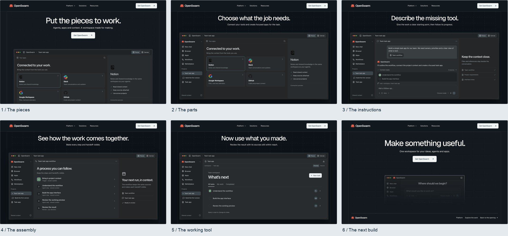

**Composition:** A compact centered title above a substantial app library. Functional modules carry the visual identity from the start.

**Reference foundation:** Cohere / native OpenSwarm. Supplied anchored reflow videos.

**Motion direction:** Large modules dock into one shared shell, keeping their headers and content visible.

**Palette:** #10171c · #f4f5f6 · #82aab7

### 1. The pieces

**Put the pieces to work.**

A compact centered title above a substantial app library. Functional modules carry the visual identity from the start.

Motion: Selecting an app changes the attached detail panel without moving the surrounding shell.

Review action: Explore the native product surface. [Open scene](http://localhost:5173/?direction=assembly&frame=1)

### 2. The parts

**Choose what the job needs.**

Connect your tools and create focused apps for the task.

Motion: A native application library opens with a clear selected-app detail view.

Review action: Select an app and inspect its details. [Open scene](http://localhost:5173/?direction=assembly&frame=2)

### 3. The instructions

**Describe the missing tool.**

Give the work a clear starting point, then follow its progress.

Motion: A build request becomes a concrete plan inside the same shell.

Review action: Run the sample request. [Open scene](http://localhost:5173/?direction=assembly&frame=3)

### 4. The assembly

**See how the work comes together.**

Make every step and handoff visible.

Motion: Steps connect vertically and respond as their state changes.

Review action: Toggle a workflow step. [Open scene](http://localhost:5173/?direction=assembly&frame=4)

### 5. The working tool

**Now use what you made.**

Review the result with its sources still within reach.

Motion: The browser module becomes a usable task app while retaining its tab bar.

Review action: Explore or download the result. [Open scene](http://localhost:5173/?direction=assembly&frame=5)

### 6. The next build

**Make something useful.**

One workspace for your ideas, agents and apps.

Motion: The modular frame resolves into a centered invitation and compact navigation.

Review action: Return to the opening. [Open scene](http://localhost:5173/?direction=assembly&frame=6)

## 22 / Tidal

A wide coastal image and a horizontal page rhythm organize the planning story. Product details stay large and front-facing.

[Open this direction](http://localhost:5173/?direction=tidal) · [Full storyboard image](media/board-22-tidal.jpg)

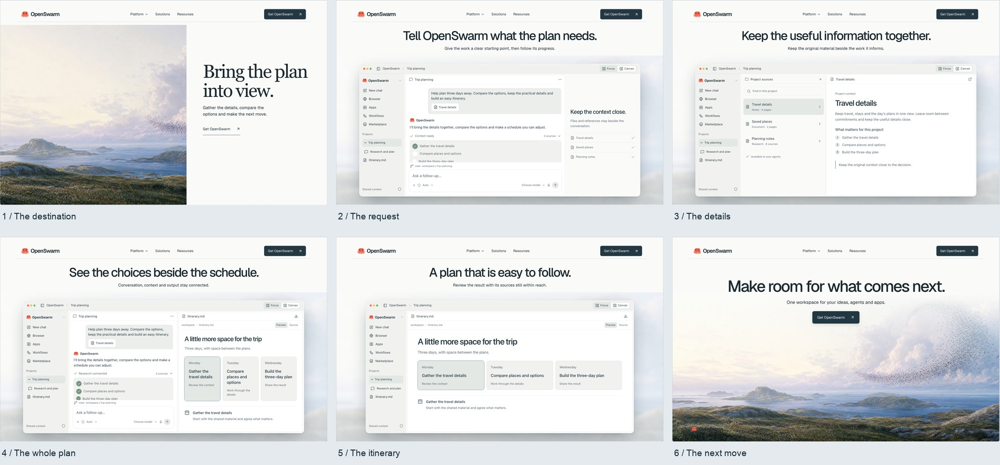

**Composition:** A large coastline crop at left meets a paper column at right, with the headline and action arranged as a travel editorial.

**Reference foundation:** Tasklify / SEOmade. Native calendar and source list structure.

**Motion direction:** Each chapter moves along the horizon while the product’s selected tab stays anchored.

**Palette:** #fafbf9 · #243333 · #a8bfcd

### 1. The destination

**Bring the plan into view.**

A large coastline crop at left meets a paper column at right, with the headline and action arranged as a travel editorial.

Motion: The coastal film moves within its fixed crop; the planning interface enters in chapter two.

Review action: Continue into the product story. [Open scene](http://localhost:5173/?direction=tidal&frame=1)

### 2. The request

**Tell OpenSwarm what the plan needs.**

Give the work a clear starting point, then follow its progress.

Motion: The composer expands into a readable planning conversation.

Review action: Run the sample request. [Open scene](http://localhost:5173/?direction=tidal&frame=2)

### 3. The details

**Keep the useful information together.**

Keep the original material beside the work it informs.

Motion: Options appear in one source drawer with a detailed selection view.

Review action: Select and inspect a source. [Open scene](http://localhost:5173/?direction=tidal&frame=3)

### 4. The whole plan

**See the choices beside the schedule.**

Conversation, context and output stay connected.

Motion: The workspace expands into an aligned source and schedule split.

Review action: Switch Focus and Canvas. [Open scene](http://localhost:5173/?direction=tidal&frame=4)

### 5. The itinerary

**A plan that is easy to follow.**

Review the result with its sources still within reach.

Motion: The schedule comes forward with selectable days and clear details.

Review action: Explore or download the result. [Open scene](http://localhost:5173/?direction=tidal&frame=5)

### 6. The next move

**Make room for what comes next.**

One workspace for your ideas, agents and apps.

Motion: The coastline continues into a centered footer without interface overlays.

Review action: Return to the opening. [Open scene](http://localhost:5173/?direction=tidal&frame=6)

## 23 / Prism Index

A precise editorial index introduces the platform with bold cobalt image crops and neutral product detail panels.

[Open this direction](http://localhost:5173/?direction=prism) · [Full storyboard image](media/board-23-prism.jpg)

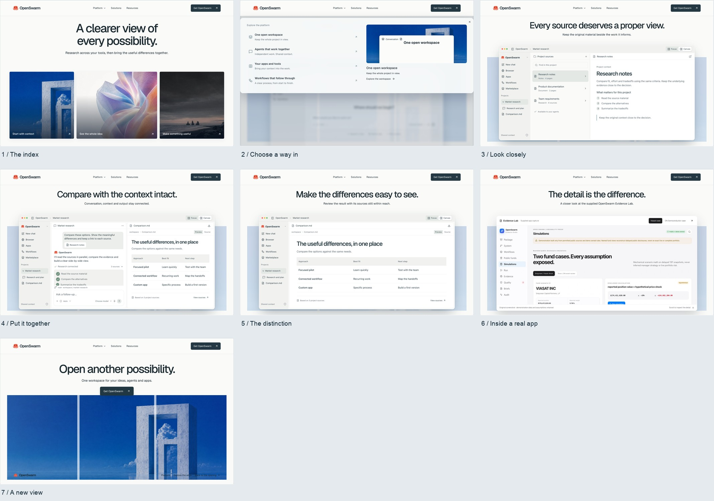

**Composition:** A graphic three-image index beneath a short centered introduction. Each image provides a different way into the product story.

**Reference foundation:** Meristem brand grid / Cohere. Native table and source switching. Supplied Evidence Lab: dense, legible panels and a visible relationship between sources and results.

**Motion direction:** Image tiles become apertures for product details; one selected tile expands into the working view.

**Palette:** #fafbf9 · #243333 · #a8bfcd

### 1. The index

**A clearer view of every possibility.**

A graphic three-image index beneath a short centered introduction. Each image provides a different way into the product story.

Motion: The selected visual opens its corresponding chapter; the hero itself contains no app mockup.

Review action: Continue into the product story. [Open scene](http://localhost:5173/?direction=prism&frame=1)

### 2. Choose a way in

**The platform, clearly organized.**

Explore the platform through the work you want to do.

Motion: A structured mega menu pairs each capability with a useful visual preview.

Review action: Open the Platform menu. [Open scene](http://localhost:5173/?direction=prism&frame=2)

### 3. Look closely

**Every source deserves a proper view.**

Keep the original material beside the work it informs.

Motion: The selected source expands from a row into the adjacent reading pane.

Review action: Select and inspect a source. [Open scene](http://localhost:5173/?direction=prism&frame=3)

### 4. Put it together

**Compare with the context intact.**

Conversation, context and output stay connected.

Motion: The image grid resolves into a clear two-pane native workspace.

Review action: Switch Focus and Canvas. [Open scene](http://localhost:5173/?direction=prism&frame=4)

### 5. The distinction

**Make the differences easy to see.**

Review the result with its sources still within reach.

Motion: A broad comparison table replaces the preview tile without changing its anchor.

Review action: Explore or download the result. [Open scene](http://localhost:5173/?direction=prism&frame=5)

### 6. Inside a real app

**The detail is the difference.**

A closer look at the supplied OpenSwarm Evidence Lab.

Motion: The actual app capture opens at a useful scale. Switch between the two supplied views and scroll through the interface.

Review action: Inspect both supplied Evidence Lab views. [Open scene](http://localhost:5173/?direction=prism&frame=6)

### 7. A new view

**Open another possibility.**

One workspace for your ideas, agents and apps.

Motion: The cobalt grid becomes a restrained footer frame around the final action.

Review action: Return to the opening. [Open scene](http://localhost:5173/?direction=prism&frame=7)

## 24 / Silhouette

A dense character-built aperture gives the opening structure and scale. Later chapters reveal the product within the same architectural frame.

[Open this direction](http://localhost:5173/?direction=silhouette) · [Full storyboard image](media/board-24-silhouette.jpg)

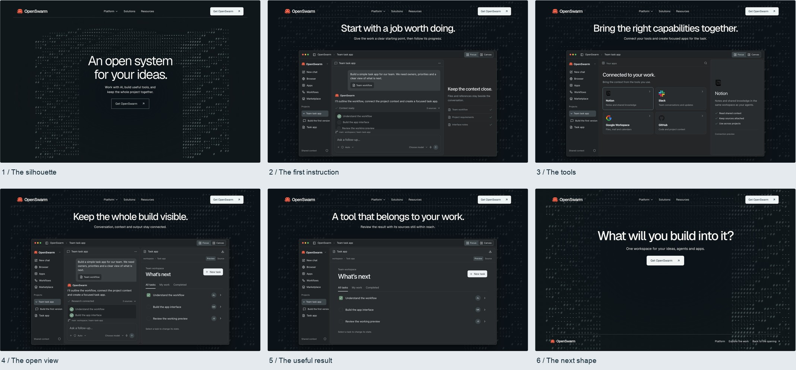

**Composition:** A dense architectural arch made entirely from text characters frames a central statement. No floating windows.

**Reference foundation:** Speakeasy / cobalt monument reference. Native browser and chat anatomy; no pixel-game rendering.

**Motion direction:** The character aperture grows around the straight app window and settles at its edges.

**Palette:** #10171c · #f4f5f6 · #82aab7

### 1. The silhouette

**An open system for your ideas.**

A dense architectural arch made entirely from text characters frames a central statement. No floating windows.

Motion: The character arch builds and releases its edges while retaining a sharply defined central opening.

Review action: Continue into the product story. [Open scene](http://localhost:5173/?direction=silhouette&frame=1)

### 2. The first instruction

**Start with a job worth doing.**

Give the work a clear starting point, then follow its progress.

Motion: The composer develops into a readable chat and supplied plan component.

Review action: Run the sample request. [Open scene](http://localhost:5173/?direction=silhouette&frame=2)

### 3. The tools

**Bring the right capabilities together.**

Connect your tools and create focused apps for the task.

Motion: A native app library occupies the character aperture with clear selected state.

Review action: Select an app and inspect its details. [Open scene](http://localhost:5173/?direction=silhouette&frame=3)

### 4. The open view

**Keep the whole build visible.**

Conversation, context and output stay connected.

Motion: The app shell opens horizontally while the character field retains its density.

Review action: Switch Focus and Canvas. [Open scene](http://localhost:5173/?direction=silhouette&frame=4)

### 5. The useful result

**A tool that belongs to your work.**

Review the result with its sources still within reach.

Motion: A working browser preview fills the aperture, with the chat still attached.

Review action: Explore or download the result. [Open scene](http://localhost:5173/?direction=silhouette&frame=5)

### 6. The next shape

**What will you build into it?**

One workspace for your ideas, agents and apps.

Motion: The character frame closes around a centered call to action.

Review action: Return to the opening. [Open scene](http://localhost:5173/?direction=silhouette&frame=6)

## 25 / Daybreak

A bright editorial opening gives way to a dark scenic product chapter. Contrast creates pace while the same components provide continuity.

[Open this direction](http://localhost:5173/?direction=daybreak) · [Full storyboard image](media/board-25-daybreak.jpg)

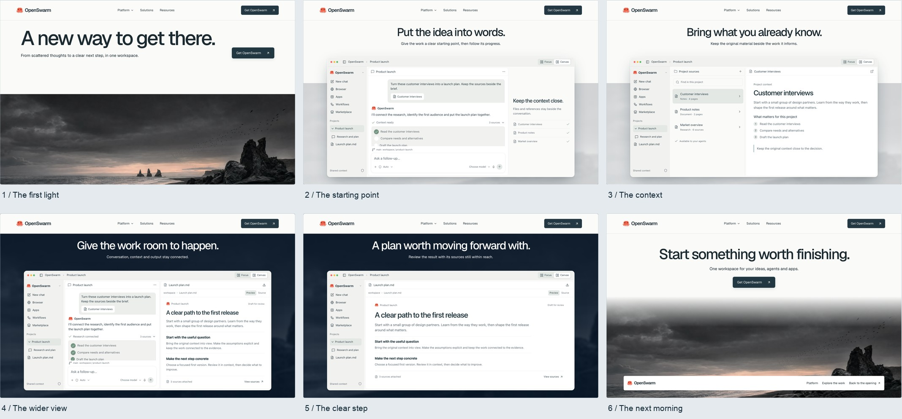

**Composition:** A bold left-aligned statement on white paper, separated from the lower coastal film by a clean horizontal edge.

**Reference foundation:** Nexora section rhythm / Cohere. OpenSwarm flat-to-canvas behavior.

**Motion direction:** A dark image band expands into a full scene as the native workspace grows from it.

**Palette:** #fafbf9 · #243333 · #a8bfcd

### 1. The first light

**A new way to get there.**

A bold left-aligned statement on white paper, separated from the lower coastal film by a clean horizontal edge.

Motion: The dark film band expands upward when the work enters the story.

Review action: Continue into the product story. [Open scene](http://localhost:5173/?direction=daybreak&frame=1)

### 2. The starting point

**Put the idea into words.**

Give the work a clear starting point, then follow its progress.

Motion: The native composer opens into a launch conversation inside the image band.

Review action: Run the sample request. [Open scene](http://localhost:5173/?direction=daybreak&frame=2)

### 3. The context

**Bring what you already know.**

Keep the original material beside the work it informs.

Motion: The app opens a source drawer without adding floating cards.

Review action: Select and inspect a source. [Open scene](http://localhost:5173/?direction=daybreak&frame=3)

### 4. The wider view

**Give the work room to happen.**

Conversation, context and output stay connected.

Motion: The dark scene fills the frame as the workspace expands to two panes.

Review action: Switch Focus and Canvas. [Open scene](http://localhost:5173/?direction=daybreak&frame=4)

### 5. The clear step

**A plan worth moving forward with.**

Review the result with its sources still within reach.

Motion: The neutral document brightens against the dark coast.

Review action: Explore or download the result. [Open scene](http://localhost:5173/?direction=daybreak&frame=5)

### 6. The next morning

**Start something worth finishing.**

One workspace for your ideas, agents and apps.

Motion: A white closing panel returns beneath the dark horizon with concise links.

Review action: Return to the opening. [Open scene](http://localhost:5173/?direction=daybreak&frame=6)

## 26 / Weave

Dense flowing glyphs form woven bands around meaningful workflow surfaces. The layout has rhythm, density and real product content.

[Open this direction](http://localhost:5173/?direction=weave) · [Full storyboard image](media/board-26-weave.jpg)

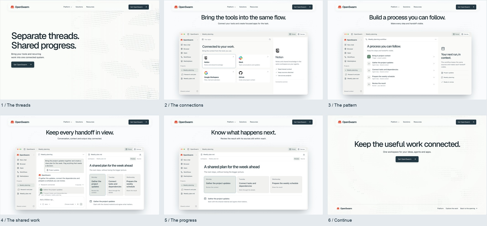

**Composition:** A fine woven character field fills the right side, balanced by a large left-aligned headline and clear action.

**Reference foundation:** Speakeasy / OpenSwarm workflow tethers. Cohere’s light geometric diagrams.

**Motion direction:** Character bands interlock as workflow steps connect, then open around the result.

**Palette:** #fafbf9 · #243333 · #a8bfcd

### 1. The threads

**Separate threads. Shared progress.**

A fine woven character field fills the right side, balanced by a large left-aligned headline and clear action.

Motion: Glyph bands interlock along the right edge, then resolve into the workflow sequence.

Review action: Continue into the product story. [Open scene](http://localhost:5173/?direction=weave&frame=1)

### 2. The connections

**Bring the tools into the same flow.**

Connect your tools and create focused apps for the task.

Motion: A native app list opens with an adjacent capability detail panel.

Review action: Select an app and inspect its details. [Open scene](http://localhost:5173/?direction=weave&frame=2)

### 3. The pattern

**Build a process you can follow.**

Make every step and handoff visible.

Motion: Steps join into one vertical sequence with visible state changes.

Review action: Toggle a workflow step. [Open scene](http://localhost:5173/?direction=weave&frame=3)

### 4. The shared work

**Keep every handoff in view.**

Conversation, context and output stay connected.

Motion: The workflow and chat dock into a wide stable workspace.

Review action: Switch Focus and Canvas. [Open scene](http://localhost:5173/?direction=weave&frame=4)

### 5. The progress

**Know what happens next.**

Review the result with its sources still within reach.

Motion: The schedule resolves in the foreground while the weave stays at the edges.

Review action: Explore or download the result. [Open scene](http://localhost:5173/?direction=weave&frame=5)

### 6. Continue

**Keep the useful work connected.**

One workspace for your ideas, agents and apps.

Motion: The glyph bands settle around a centered invitation and compact footer.

Review action: Return to the opening. [Open scene](http://localhost:5173/?direction=weave&frame=6)

## 27 / Blue Hour

A cinematic architectural environment frames a product-heavy story. The interface occupies the center with confident scale.

[Open this direction](http://localhost:5173/?direction=blueprint) · [Full storyboard image](media/board-27-blueprint.jpg)

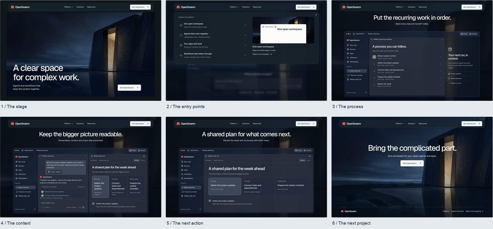

**Composition:** A cinematic architectural panorama within a dark page frame. Headline and action sit low in the image, leaving the upper space open.

**Reference foundation:** Cobalt architecture / Nexora. Native dark workflow and layout anatomy. Spatial UI references: layered translucent chrome, detached rails, and soft depth around front-facing native content.

**Motion direction:** A foreground veil clears around a large workspace; handoffs shift focus without moving the entire stage.

**Palette:** #10171c · #f4f5f6 · #82aab7

### 1. The stage

**A clear space for complex work.**

A cinematic architectural panorama within a dark page frame. Headline and action sit low in the image, leaving the upper space open.

Motion: The architectural frame opens from the center; a soft foreground veil clears before the app chapter.

Review action: Continue into the product story. [Open scene](http://localhost:5173/?direction=blueprint&frame=1)

### 2. The entry points

**Find the tools for your work.**

Explore the platform through the work you want to do.

Motion: A frosted mega menu reveals capabilities with an enlarged product preview.

Review action: Open the Platform menu. [Open scene](http://localhost:5173/?direction=blueprint&frame=2)

### 3. The process

**Put the recurring work in order.**

Make every step and handoff visible.

Motion: A native workflow fills the stage with clear steps and handoffs.

Review action: Toggle a workflow step. [Open scene](http://localhost:5173/?direction=blueprint&frame=3)

### 4. The context

**Keep the bigger picture readable.**

Conversation, context and output stay connected.

Motion: The workflow joins its conversation inside one straight wide window.

Review action: Switch Focus and Canvas. [Open scene](http://localhost:5173/?direction=blueprint&frame=4)

### 5. The next action

**A shared plan for what comes next.**

Review the result with its sources still within reach.

Motion: The schedule moves into focus while the surrounding scene remains softly lit.

Review action: Explore or download the result. [Open scene](http://localhost:5173/?direction=blueprint&frame=5)

### 6. The next project

**Bring the complicated part.**

One workspace for your ideas, agents and apps.

Motion: The architecture opens around a centered closing action.

Review action: Return to the opening. [Open scene](http://localhost:5173/?direction=blueprint&frame=6)

## 28 / Airlight

A large white product shell floats within a broad cloud field. The design earns lightness through scale and clear hierarchy, not emptiness.

[Open this direction](http://localhost:5173/?direction=airlight) · [Full storyboard image](media/board-28-airlight.jpg)

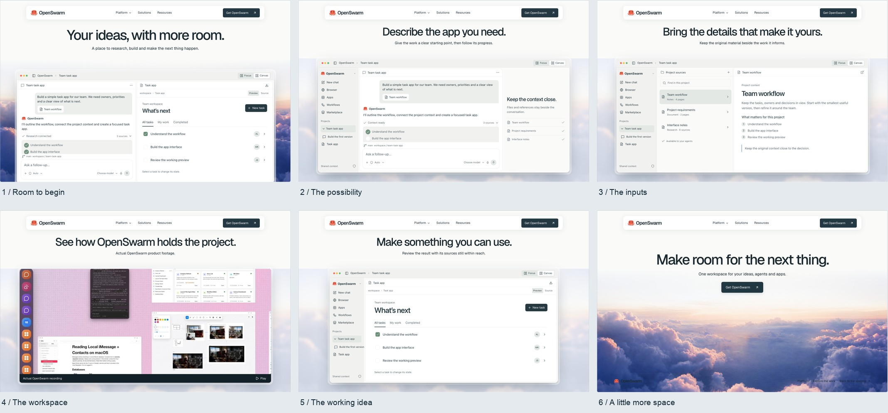

**Composition:** The workspace is the hero: a concise centered introduction above the largest native canvas in the collection.

**Reference foundation:** Tasklify / Cohere. Native sidebar, file tabs and app preview.

**Motion direction:** The centered composer expands into a full desktop shell; the cloud layer fades behind opaque reading surfaces.

**Palette:** #fafbf9 · #243333 · #a8bfcd

### 1. Room to begin

**Your ideas, with more room.**

The workspace is the hero: a concise centered introduction above the largest native canvas in the collection.

Motion: The two panes open directly into Focus and Canvas views, with a restrained cloud backdrop.

Review action: Explore the native product surface. [Open scene](http://localhost:5173/?direction=airlight&frame=1)

### 2. The possibility

**Describe the app you need.**

Give the work a clear starting point, then follow its progress.

Motion: The composer opens vertically into chat, tool groups and a supplied plan.

Review action: Run the sample request. [Open scene](http://localhost:5173/?direction=airlight&frame=2)

### 3. The inputs

**Bring the details that make it yours.**

Keep the original material beside the work it informs.

Motion: A file drawer opens inside the shell with a full preview.

Review action: Select and inspect a source. [Open scene](http://localhost:5173/?direction=airlight&frame=3)

### 4. The workspace

**See how OpenSwarm holds the project.**

Actual OpenSwarm product footage.

Motion: The actual canvas recording fills the same large frame.

Review action: Play the native product recording. [Open scene](http://localhost:5173/?direction=airlight&frame=4)

### 5. The working idea

**Make something you can use.**

Review the result with its sources still within reach.

Motion: A task app opens inside the native browser pane with working controls.

Review action: Explore or download the result. [Open scene](http://localhost:5173/?direction=airlight&frame=5)

### 6. A little more space

**Make room for the next thing.**

One workspace for your ideas, agents and apps.

Motion: The shell fades into the lower cloud bank beneath a centered action.

Review action: Return to the opening. [Open scene](http://localhost:5173/?direction=airlight&frame=6)

## 29 / Continuum

A flowing optical opening leads into one continuous product surface. The background shifts its emphasis while the work retains its place.

[Open this direction](http://localhost:5173/?direction=continuum) · [Full storyboard image](media/board-29-continuum.jpg)

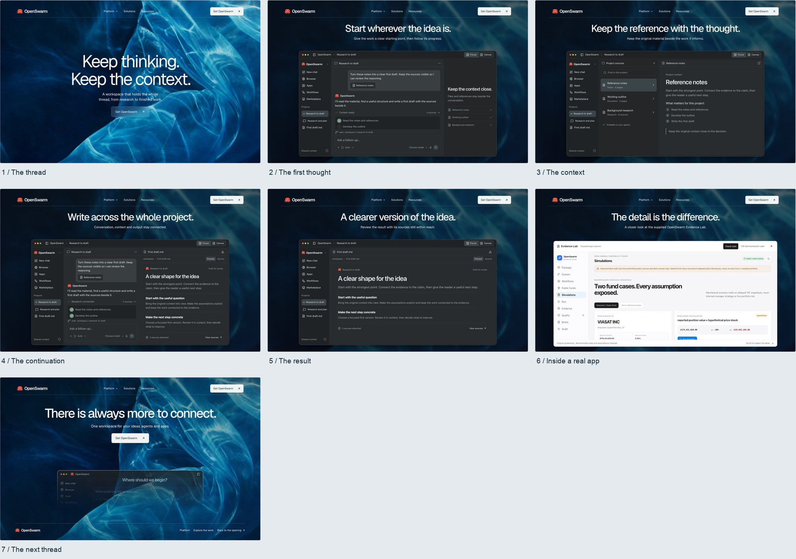

**Composition:** Full-bleed cyan optical material and a short, centered statement. The opening is an immersive moving identity surface.

**Reference foundation:** Meristem / supplied continuity motion. Native context drawer and document split view. Supplied Evidence Lab: dense, legible panels and a visible relationship between sources and results.

**Motion direction:** The same window persists across every chapter; only its internal layout and focus change.

**Palette:** #10171c · #f4f5f6 · #82aab7

### 1. The thread

**Keep thinking. Keep the context.**

Full-bleed cyan optical material and a short, centered statement. The opening is an immersive moving identity surface.

Motion: A slow optical drift carries into the later workspace without replacing the visual environment.

Review action: Continue into the product story. [Open scene](http://localhost:5173/?direction=continuum&frame=1)

### 2. The first thought

**Start wherever the idea is.**

Give the work a clear starting point, then follow its progress.

Motion: The same composer expands into a writing conversation.

Review action: Run the sample request. [Open scene](http://localhost:5173/?direction=continuum&frame=2)

### 3. The context

**Keep the reference with the thought.**

Keep the original material beside the work it informs.

Motion: The source drawer opens from the current window, preserving the conversation.

Review action: Select and inspect a source. [Open scene](http://localhost:5173/?direction=continuum&frame=3)

### 4. The continuation

**Write across the whole project.**

Conversation, context and output stay connected.

Motion: The document opens alongside the chat within one shared shell.

Review action: Switch Focus and Canvas. [Open scene](http://localhost:5173/?direction=continuum&frame=4)

### 5. The result

**A clearer version of the idea.**

Review the result with its sources still within reach.

Motion: The document takes focus while its source and conversation remain attached.

Review action: Explore or download the result. [Open scene](http://localhost:5173/?direction=continuum&frame=5)

### 6. Inside a real app

**The detail is the difference.**

A closer look at the supplied OpenSwarm Evidence Lab.

Motion: The actual app capture opens at a useful scale. Switch between the two supplied views and scroll through the interface.

Review action: Inspect both supplied Evidence Lab views. [Open scene](http://localhost:5173/?direction=continuum&frame=6)

### 7. The next thread

**There is always more to connect.**

One workspace for your ideas, agents and apps.

Motion: The same window settles beneath a centered closing action and compact footer.

Review action: Return to the opening. [Open scene](http://localhost:5173/?direction=continuum&frame=7)

## 30 / Confluence

A richly painted landscape anchors a dense, useful research story. Native sources and comparisons provide the structure.

[Open this direction](http://localhost:5173/?direction=confluence) · [Full storyboard image](media/board-30-confluence.jpg)

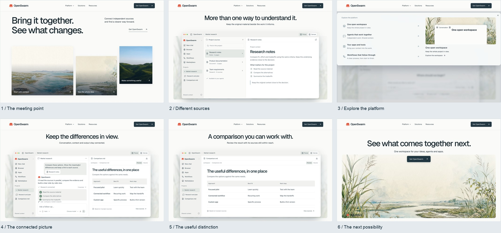

**Composition:** An offset watercolor editorial spread with a large headline at upper-left and three painted apertures across the lower page.

**Reference foundation:** SEOmade / Cohere editorial spreads. Native source previews and table comparison.

**Motion direction:** Sources gather along a painted river edge; the result grows into a full-width product spread.

**Palette:** #fafbf9 · #243333 · #a8bfcd

### 1. The meeting point

**Bring it together. See what changes.**

An offset watercolor editorial spread with a large headline at upper-left and three painted apertures across the lower page.

Motion: The three image apertures lead to sources, the shared canvas and the resulting document.

Review action: Continue into the product story. [Open scene](http://localhost:5173/?direction=confluence&frame=1)

### 2. Different sources

**More than one way to understand it.**

Keep the original material beside the work it informs.

Motion: The source library opens with clear selected states and a generous preview.

Review action: Select and inspect a source. [Open scene](http://localhost:5173/?direction=confluence&frame=2)

### 3. Explore the platform

**Find a useful way into the work.**

Explore the platform through the work you want to do.

Motion: The solid header expands into a full capability index with a live visual preview.

Review action: Open the Platform menu. [Open scene](http://localhost:5173/?direction=confluence&frame=3)

### 4. The connected picture

**Keep the differences in view.**

Conversation, context and output stay connected.

Motion: The source library and conversation form one expansive workspace.

Review action: Switch Focus and Canvas. [Open scene](http://localhost:5173/?direction=confluence&frame=4)

### 5. The useful distinction

**A comparison you can work with.**

Review the result with its sources still within reach.

Motion: The table expands along the river line while painted edges recede.

Review action: Explore or download the result. [Open scene](http://localhost:5173/?direction=confluence&frame=5)

### 6. The next possibility

**See what comes together next.**

One workspace for your ideas, agents and apps.

Motion: The landscape carries through the compact footer around a centered invitation.

Review action: Return to the opening. [Open scene](http://localhost:5173/?direction=confluence&frame=6)

